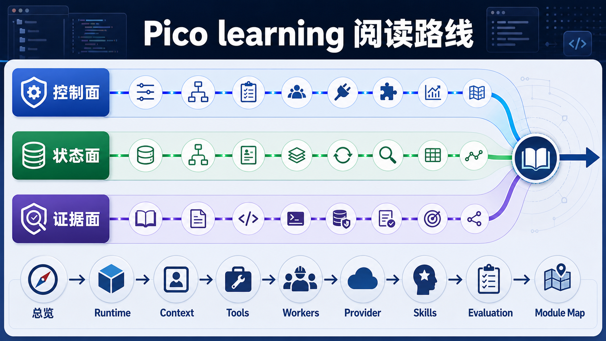

# Pico learning 阅读索引

这个目录把 Pico 当成一个本地 coding agent harness 来读，不按源码文件逐个翻译，也不把它写成 Agent 概念科普。读法只有一个目标：看清每个模块在整条执行链里解决什么问题，以及它和 Claude Code 这类成熟系统相比差在哪里。



参考口径有两类。

- Pico 当前源码：以 `pico/`、`tests/`、`release/v3/REVIEW.md` 为准。
- Claude Code 对标：参考 `/Users/martinlos/code/civil-engineering-cloud-claude-code-source-v2.1.88/02-claude-code-source-research/`。这份材料是本地研究快照，不按官方源码口径宣传，只把它当成架构参照物。

## 阅读顺序

如果只想快速建立全局图，先读：

1. `01-overall-architecture.md`
2. `02-runtime-engine.md`
3. `03-context-memory-compact.md`
4. `04-tools-permissions-sandbox.md`

如果要准备面试追问，继续读：

5. `05-workers-plan-todo.md`
6. `06-providers-config.md`
7. `07-skills-commands-cli-tui.md`
8. `08-session-run-evaluation.md`
9. `09-module-map.md`

如果想按“模块为什么存在”的方式读，补一篇：

10. `10-module-learning-guide.md`

如果想单独理解后台长期记忆整理，继续读：

11. `11-dream-memory-consolidation.md`

## 文档覆盖关系

| 文档 | 主要回答的问题 | Pico 模块 |
| --- | --- | --- |
| `01-overall-architecture.md` | Pico 到底是一个什么系统 | `cli.py`、`core/`、`tools/`、`features/`、`providers/`、`evaluation/`、`tui/` |
| `02-runtime-engine.md` | 一条请求怎么被推进、暂停、结束 | `core/runtime.py`、`core/engine.py`、`core/engine_helpers.py`、`core/model_output.py`、`core/tool_executor.py` |
| `03-context-memory-compact.md` | 长任务里 prompt、记忆和压缩怎么分工 | `core/context_manager.py`、`features/memory.py`、`core/compact.py`、`core/turn_history.py`、`core/context_usage.py` |
| `04-tools-permissions-sandbox.md` | 模型为什么不能直接碰外部世界 | `tools/`、`core/permissions.py`、`core/tool_policy.py`、`core/tool_profiles.py`、`features/sandbox/` |
| `05-workers-plan-todo.md` | 子 agent、计划模式和任务 ledger 怎么形成控制面 | `core/worker_manager.py`、`core/worker_runtime.py`、`core/worker_execution.py`、`tools/agents.py`、`core/plan_mode.py`、`core/todo_ledger.py` |
| `06-providers-config.md` | 多 provider 怎么被收敛成 runtime 能用的小接口 | `providers/`、`config/`、`cli.py`、`core/runtime_secrets.py`、`providers/errors.py` |
| `07-skills-commands-cli-tui.md` | 人怎么和 agent 交互，skill 怎么进入 prompt | `features/skills.py`、`features/skills_runtime.py`、`features/skills_bundled.py`、`commands/slash.py`、`cli.py`、`tui/` |
| `08-session-run-evaluation.md` | 怎么恢复、复盘和证明系统跑得稳 | `core/session_store.py`、`core/session_events.py`、`core/run_store.py`、`core/task_state.py`、`evaluation/`、`testing.py` |
| `09-module-map.md` | 每个源码文件在系统里属于哪一层 | 整个 `pico/` 包和主要测试文件 |
| `10-module-learning-guide.md` | 从最小 Agent 过渡到 Pico v3，每个模块为什么要存在 | `core/`、`tools/`、`features/`、`providers/`、`commands/`、`tui/`、`evaluation/` |
| `11-dream-memory-consolidation.md` | Dream 后台记忆整合解决什么问题、怎么实现、差距在哪里 | `features/memory.py`、`core/runtime.py`、`core/context_manager.py`、`.pico/memory/` |

## 一张系统图

```text
CLI / TUI / slash command
        |
        v
Pico runtime object graph
        |
        v
Engine.run_turn()
        |
        +--> ContextManager builds prompt
        |       +--> prefix / memory / skills / relevant memory / history / current request
        |
        +--> Provider client complete()
        |
        +--> model_output.parse()
        |
        +--> tool_executor.run_tool()
        |       +--> permission checker
        |       +--> tool policy checker
        |       +--> registry tool runner
        |       +--> sandbox runner when shell is enabled
        |
        +--> state writes
                +--> session json
                +--> events jsonl
                +--> run task_state / trace / report
                +--> memory maintenance / auto-dream
```

## 和 Claude Code 的关系

这套文档不按最小 agent 教学路线展开。Pico 已经越过最小 loop，重点在运行时治理：状态、恢复、上下文预算、工具边界、子 agent、评测工件。

Claude Code 是更大的参照物。它有完整的 TypeScript/Ink 产品壳、几十个工具、MCP、插件、技能、bridge、remote、团队记忆、自动压缩和实验控制面。Pico 不需要复制它的体量，但应该学习它的几个工程判断：prompt 是运行时资产，tool 是协议，memory 要分寿命，API 层要承担可靠性，评测和实验要成为控制面。

## 当前结论

Pico 的价值在于先闭合本地 coding agent 需要的几条链：请求能进入主循环，主循环能调用模型和工具，工具有边界，状态能落盘，历史能压缩，记忆能跨 session 留住，run 能被复盘，benchmark 能做回归。它距离 Claude Code 的平台复杂度还很远，但作为一个面试和学习用的本地 harness，架构骨架已经成立。
