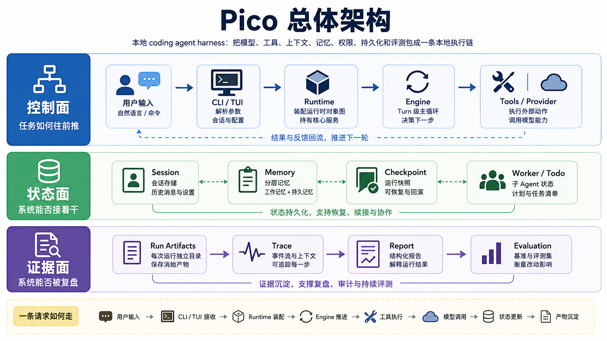

# 总体架构：Pico 是本地 coding agent harness，不是聊天壳

Pico 的主线可以先压成一句话：它把模型、工具、上下文、记忆、权限、持久化和评测包成一条本地执行链，让模型能在真实代码仓库里连续工作，而不是只回答一次问题。



这句话里最关键的是执行链。模型能力只是其中一环。系统能不能做长任务，主要看模型外面有没有控制面、状态面和证据面。

## Pico 的三层

```text
控制面：CLI/TUI -> Runtime -> Engine -> Tool/Provider
状态面：Session -> Memory -> Checkpoint -> Worker/Todo
证据面：Run artifacts -> Trace -> Report -> Benchmark/Metrics
```

控制面决定任务怎么往前推。`pico/cli.py` 把命令行参数、provider 配置、工作区和 session store 装成一个 `Pico` 实例；`pico/core/runtime.py` 持有运行时对象图；`pico/core/engine.py` 负责 turn 级主循环；`pico/tools/` 和 `pico/providers/` 分别接外部动作和模型后端。

状态面决定系统能不能接着干。`SessionStore` 保存会话，`LayeredMemory` 保存工作记忆，`.pico/memory/` 保存 durable memory，`PlanModeController` 和 `TodoLedger` 保存当前计划和任务 ledger，`WorkerManager` 保存子 agent 状态。

证据面决定系统能不能被复盘。每次 `ask()` 都有独立 run 目录，里面有 `task_state.json`、`trace.jsonl`、`report.json`。`evaluation/` 再把固定任务、fixture、verifier 和 metrics 接起来，用来判断改动有没有破坏 harness 行为。

## 一条请求怎么走

```text
用户输入
  -> CLI/TUI 判断是 slash command 还是普通任务
  -> Pico.ask()
  -> Engine.run_turn()
  -> ContextManager 组装 prompt
  -> Provider client 调模型
  -> model_output.parse() 解析 <tool> 或 <final>
  -> tool_executor 执行工具并写 trace
  -> 继续下一轮或结束 run
```

这个流程里有两个关键拆分。

第一，`Runtime` 和 `Engine` 分开。`Pico` 负责持有工作区、session、memory、tools、workers、permissions、context manager；`Engine` 负责把一个用户请求推进成模型调用、工具调用、最终回答和 run 工件。这样读代码时不用把对象装配和循环推进混在一起。

第二，工具执行和模型输出解析都被拆出去。`core/model_output.py` 只处理 Pico 的文本协议，把模型返回解析成 `tool/tools/final/retry`；`core/tool_executor.py` 只处理工具调用边界，包括参数校验、权限、policy、重复调用、工作区 diff 和输出截断。

## 为什么不是最小 ReAct

最小 agent 教学实现通常会把智能体拆成四块：context 管消息，LLM 管模型，tools 管工具，agent 管 ReAct 循环。这个拆法适合教学，因为它先把最小闭环讲清楚。

Pico 的问题更靠后一层。它关心的不只是 LLM 能不能调用工具，还包括这些问题：

- 任务跑了十几轮后，prompt 里到底保留哪些信息。
- 工具调用失败、重复、越权、部分成功时，系统怎么记录和恢复。
- 子 agent 怎么有边界地执行，不把主 runtime 搞乱。
- 上下文压缩、checkpoint、durable memory 和 session history 怎么分工。
- 一个版本到底有没有变好，靠什么 benchmark 和 trace 证明。

所以 Pico 的模块数量更多，原因是它开始处理最小 agent 之外的工程问题，不是单纯做功能扩张。

## 和 Claude Code 的对标

Claude Code 的本地研究快照里，核心入口是 `QueryEngine.ts` 和 `query.ts`。它有更完整的产品控制面：命令、工具、权限、MCP、skills、plugins、bridge、remote、compact、memory extractor、feature flags 和 telemetry。

Pico 对标它时，不能用功能数量比较。更有价值的比较是系统分层：

| 维度 | Pico | Claude Code |
| --- | --- | --- |
| 主循环 | `Engine.run_turn()`，文本协议 `<tool>/<final>` | `QueryEngine.submitMessage()` + `query()`，SDK message / streaming / tool block |
| Prompt | `ContextManager` 固定 section 和预算 | system prompt parts、user context、memory attachments、compact 后消息 |
| 工具 | 显式 Python registry，少量内置工具 | 大量独立工具模块，MCP、LSP、Web、Notebook、Task、Team |
| 权限 | tool profile + approval policy + write scope + sandbox | permission context、mode、hooks、interactive handler、coordinator handler |
| 记忆 | working memory + durable memory + auto-dream | CLAUDE.md、auto memory、team memory、session memory、background extractor |
| 状态 | session JSON、events JSONL、run artifacts | transcript、SDK messages、AppState、task state、telemetry |
| UI | plain REPL + Textual TUI | React/Ink + bridge + remote + desktop handoff |

Pico 的优势是小而可读，模块边界容易讲清楚。Claude Code 的优势是产品级覆盖面和长期任务可靠性更完整。学习时可以拿 Claude Code 做参照，但不要把它的全部复杂度搬进 Pico。

## 现在的架构判断

Pico 已经形成了一个可评审的本地 harness：

- `core/` 是控制平面和状态平面。
- `tools/` 是模型能触达外部世界的动作面。
- `features/` 是记忆、技能、沙箱这类可插拔能力。
- `providers/` 是模型协议适配层。
- `commands/`、`cli.py`、`tui/` 是用户入口。
- `evaluation/` 和 `testing.py` 是回归和证据层。

后续更值得补强的是 Claude Code 已经证明有价值的几层：更细的 prompt section registry，更强的工具使用协议，更可靠的 provider streaming 和 watchdog，更完整的 memory extractor 和模型行为回归档案。

## 设计文档级补充：Pico v3 的系统边界

这一篇如果按设计文档来读，核心问题不是“Pico 有哪些模块”，而是：一个本地 coding agent 从演示程序变成 runtime harness，需要把哪些不稳定因素收进系统边界。

最小 ReAct 循环只证明模型能交替“思考”和“行动”。ReAct 论文强调 reasoning traces 可以帮助模型维护和更新行动计划，actions 可以让模型从外部环境取回信息。这个观察解释了 agent loop 为什么有效，但没有解决本地 coding agent 的工程问题：工具越权、上下文膨胀、会话恢复、长输出、子任务隔离、结果验收、provider 失败。这些问题都发生在模型外面。

Pico v3 的架构边界可以压成四句话：

- `Pico` 是运行现场，不是模型 wrapper。
- `Engine` 是 turn 级状态机，不是 while 循环脚本。
- `ToolExecutor` 是动作网关，不是函数分发器。
- `RunStore` / `SessionStore` 是证据面，不是日志顺手落盘。

这四句话决定了 v3 的模块拆法。

### 设计目标

Pico v3 的目标不是复制完整商业 coding agent，而是建立一个可解释、可复盘、可验证的本地 harness。它要满足五个工程约束：

1. 一条请求必须能被拆成可审计的模型轮次和工具轮次。
2. 每个外部动作必须经过权限、策略、路径和重复调用检查。
3. 运行状态必须能落盘，进程结束后仍能解释“为什么停下”。
4. 长任务必须有上下文预算和记忆分层，不能靠无限 transcript。
5. 版本改动必须有 benchmark、real-session gate 或 run artifact 作为证据。

这也是为什么 Pico 不把所有逻辑塞进 `runtime.py`。一旦系统开始负责权限、记忆、worker、compact、evidence，单文件主循环会变成不可审计的状态泥团。

### 当前实现分层

```text
User surface
  CLI / REPL / TUI / slash commands

Runtime control plane
  Pico object graph
  Engine turn loop
  Runtime mode
  Tool profile
  Worker manager
  Todo ledger

Context and memory plane
  ContextManager
  LayeredMemory
  Durable memory
  Compact manager
  Dream maintenance

Action boundary
  Tool registry
  Permission checker
  Tool policy checker
  Sandbox runner
  Provider clients

Evidence plane
  Session JSON
  Session events JSONL
  Run task_state
  Run trace
  Run report
  Evaluation artifacts
```

这张分层图比目录图更重要。目录会变，边界不能乱。比如 `features/memory.py` 很大，但它不应该变成主循环；`tui/app.py` 负责交互，但不应该重新实现权限；`providers/clients.py` 负责协议，但不应该决定工具策略。

### 和成熟系统的对应关系

成熟 coding agent 往往会把系统拆成 query engine、tool protocol、permission context、command registry、memory subsystem、transcript store、UI renderer、telemetry 和 experiment control。Pico v3 没有同等体量，但已经有相同的骨架：

| 成熟系统问题 | Pico v3 对应实现 | 当前缺口 |
| --- | --- | --- |
| Query lifecycle | `Engine.run_turn()` | 缺少 streaming block、partial output、idle watchdog |
| Tool protocol | `tools/` + `tool_executor.py` | 工具 schema 和执行策略仍然偏集中 |
| Permission context | `PermissionChecker` + profiles | 缺少 hook、policy source、交互式 denial history |
| Context lifecycle | `ContextManager` + `CompactManager` | compact 策略还不够多层 |
| Memory lifecycle | `LayeredMemory` + durable memory + Dream | 输出 store、review/discard、task lifecycle 还不完整 |
| Transcript/evidence | `SessionStore` + `RunStore` | 用户消息先写 transcript 的恢复语义还不够激进 |
| UI events | TUI event rendering | 没有 IDE bridge、remote/mobile handoff |
| Evaluation | benchmark + human scenario gate | 没有长期模型行为档案和线上实验控制面 |

这个对照说明 Pico 的取舍：先做清楚边界，再扩大能力面。

### 失败模式

Pico 作为 harness，最危险的失败不是“回答不好”，而是下面这些系统性失败：

- 模型执行了越权写操作，但 trace 里看不出来。
- 工具被拒绝后，模型无限重试同一调用。
- compact 把关键 tool result 裁掉，后续判断失真。
- durable memory 混入临时状态，下一次 session 被污染。
- provider 抛错被吞掉，用户只看到冷 stop message。
- worker 写到 scope 外，主 agent 无法解释改动来源。
- benchmark 只验证 final answer，不验证 run artifact。

v3 的设计基本都在围绕这些失败模式建防线。比如 repeated tool guard 不是用户功能，但它防止死循环；task_state 的 stop_reason 不是 UI 功能，但它让失败可分类；run_evidence 不是业务能力，但它让“真实跑过”可证明。

### 后续改进路线

如果继续做 v4，优先级应该是：

1. **Runtime event contract**：把 runtime event schema 固化，TUI、report、tests 都消费同一份事件协议。
2. **Prompt section registry**：每段 prompt 记录来源、寿命、预算、cache 影响，减少 ContextManager 的隐式规则。
3. **Tool protocol split**：工具定义、校验、权限提示、执行、结果预算进一步模块化，但保持 `Pico.run_tool()` 是总闸口。
4. **Transcript-first persistence**：用户消息进入主循环前先持久化，提高 crash 后 resume 能力。
5. **Evidence-first release gate**：把 human scenario gate、pytest、ruff、provider smoke、artifact checks 固化成 release checklist。

### 最小验收清单

判断 Pico 是否仍然是一个 harness，而不是退化成 CLI wrapper，可以看这张表：

| 验收点 | 证据 |
| --- | --- |
| 请求被状态机推进 | `trace.jsonl` 有 model/tool/final/runtime events |
| 工具有边界 | permission / policy / affected_paths 写入 trace |
| 状态可恢复 | `.pico/sessions/*.json` 和 events JSONL 存在 |
| 长任务可续航 | context metadata、compact summary、memory section 可解释 |
| 结果可复盘 | `task_state.json`、`report.json`、human scenario output 可读 |
| 版本可回归 | tests 和 scenario gate 能覆盖关键 runtime 合同 |

面试里可以这样收束：Pico 的价值不是工具数量，而是把本地 coding agent 最容易失控的几层变成显式控制面和证据面。它让模型能行动，但行动必须被约束、记录、恢复和验证。
