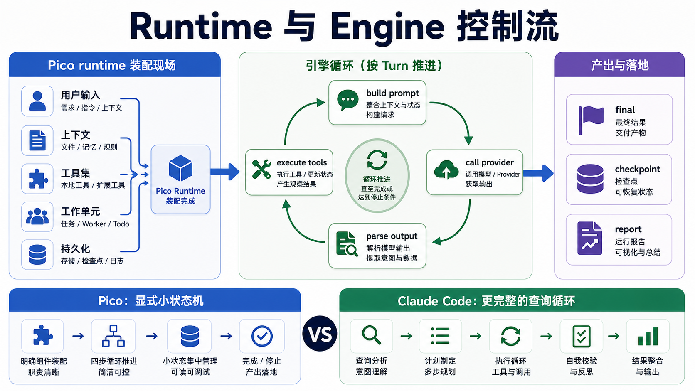

# Runtime 和 Engine：一条请求怎么被推进

Pico 当前最关键的架构变化，是把运行时对象图和 turn 级执行循环分开了。`Pico` 更像运行现场，`Engine` 负责把一次用户请求推进到底。



## Pico runtime 负责装配现场

`pico/core/runtime.py` 里的 `Pico.__init__()` 把系统运行需要的对象一次性挂好：

- `model_client` 和 `model_client_factory`
- `workspace`、`root`、`session_store`、`run_store`
- `SandboxRunner`、`PermissionChecker`
- `LayeredMemory`、`ContextManager`、`CompactManager`
- `PlanModeController`、`TodoLedger`、`WorkerManager`
- `skills`、`tools`、`tool_profiles`
- session event bus、resume state、prefix state、trace state

这层的职责是保证主循环随时能拿到一致的运行时依赖，不负责决策下一步调什么工具。比如 `build_tools()` 依赖 runtime 自己，工具 runner 需要能回到 `agent.path()`、`agent.memory`、`agent.permission_checker`、`agent.run_store` 这些状态。

## Engine.run_turn() 负责推进控制流

`pico/core/engine.py` 的 `run_turn()` 是 turn 级状态机。它先创建 `TaskState` 和 run 目录，然后进入循环：

```text
create TaskState
record user message
while under step budget:
  build prompt
  call provider
  parse model output
  if tool: execute tool and continue
  if retry: record malformed response and continue
  if final: finish, checkpoint, report
finish limited run when step/retry budget exceeded
```

这里有几个细节要单独看。

第一，`attempts` 和 `tool_steps` 分开。`attempts` 是模型调用轮数，`tool_steps` 是实际进入执行阶段的工具调用数。这样 `TaskState` 能区分模型反复 malformed 和工具跑太多这两种不同失败。

第二，prompt 每轮都重新构建。工具结果、worker notification、memory、checkpoint、todo ledger 都可能改变下一轮上下文，不能在 turn 开始时只构建一次。

第三，结束不是简单 return。成功结束时会写 assistant history，必要时退出 plan mode，promote durable memory，触发 memory maintenance，创建 checkpoint，写 task state、trace 和 report。

## model_output 是 Pico 的文本协议边界

`pico/core/model_output.py` 把模型原始文本解析成四类：

- `tool`：单个工具调用
- `tools`：多个工具调用
- `final`：最终回答
- `retry`：输出不符合协议，需要模型重来

Pico 没有直接使用 provider 原生 tool calling，而是定义了 `<tool>...</tool>` 和 `<final>...</final>` 文本协议。这个选择让 OpenAI-compatible、Anthropic-compatible、DeepSeek 走同一条 runtime 逻辑，但代价是模型必须遵守文本格式，malformed response 要靠 retry notice 拉回。

这里可以和最小 agent 实现对照看。最小实现往往直接用模型 API 的原生 tool-use 格式，上下文格式更贴近单一后端。Pico 选择文本协议，是为了 provider 统一和测试可控。

## tool_executor 是动作边界

`pico/core/tool_executor.py` 负责工具执行的统一边界，顺序大概是：

1. 查 registry，未知工具直接拒绝。
2. 调 `validate_tool()` 做参数和路径校验。
3. 调 `PermissionChecker` 做 profile、approval、plan mode、write scope 检查。
4. 调 `ToolPolicyChecker` 做更高层的行为约束。
5. 拦截连续重复调用。
6. 对 risky 工具做工作区快照，执行后 diff。
7. 更新 memory、trace metadata、process note。

这层的工程价值很大。工具不再只是函数调用，而是一个会产生审计信息的动作。`tool_status`、`tool_error_code`、`affected_paths`、`workspace_changed`、`diff_summary` 后面都会进 trace/report。

## 和 Claude Code 的 QueryEngine 对比

Claude Code 的 `QueryEngine.ts` 更像 Pico 的 `Runtime + Engine + CLI/TUI 交界` 的组合。它在 `submitMessage()` 里做了很多 Pico 目前还拆得比较简单的事情：

- 构建 system prompt parts 和 user context。
- 处理 slash command、skills、plugins、MCP clients。
- 先写 transcript，保证中途杀进程后还能 resume。
- 维护 permission denials、usage、read file cache、skill discovery。
- 把处理后的消息送进 `query.ts` 的主循环。

`query.ts` 则是更完整的模型循环。它在每轮请求前会处理 tool result budget、snip、microcompact、autocompact、system prompt、tool use context，然后再流式调用模型和工具。

Pico 的设计更轻：一轮模型调用就是 `complete_model()`，没有 streaming block，也没有 SDK message 兼容层。它的好处是读起来直，测试容易写；不足是对长输出、部分流式结果、工具并发和 provider stall 的处理还不够细。

## 当前取舍

Pico 的 runtime 拆法是合理的。`Runtime` 持有状态，`Engine` 推进循环，`model_output` 管协议解析，`tool_executor` 管动作边界，这四块各自只做一件事。

如果继续演进，优先级不是把 `Engine` 变复杂，可以先补三件事：

- provider 层返回更细的 streaming / partial / watchdog 事件，让 Engine 不必猜空响应。
- tool result budget 和大结果落盘策略更系统化，现在只有 `run_shell` 长输出会写 artifact。
- transcript 级中途持久化更激进，Claude Code 已经把用户消息先写 transcript，Pico 现在主要依赖 session/run 写入。

面试里可以这样讲：Pico 的主循环已经是 turn 级状态机。它把 prompt 构建、模型协议、工具边界、checkpoint、memory maintenance 和 run artifacts 都纳入同一条控制流，所以能解释任务为什么继续、为什么停下、停下后留下了什么证据。

## 设计文档级补充：turn loop 的可靠性边界

Pico v3 的 runtime 设计重点，是把“模型输出一次文本”变成“一个可恢复、可审计、可停止的 turn”。这里的核心不是 while 循环，而是状态转移。

一个 turn 至少包含这些状态：

```text
accepted user request
  -> run created
  -> prompt built
  -> provider requested
  -> model output parsed
  -> tool requested / retry requested / final returned
  -> tool executed or failure recorded
  -> session and run artifacts updated
  -> memory/checkpoint/report finalized
```

如果这些状态没有显式化，agent 看起来能跑，但一旦出错就只能靠 terminal scrollback 猜。

### 为什么 `Pico` 和 `Engine` 要分开

`Pico` 拥有对象图。它知道 workspace、session、memory、tools、permissions、workers、provider、context manager、run store 在哪里。

`Engine` 拥有推进逻辑。它知道一个用户请求应该如何变成一串模型调用和工具调用。

这个拆分避免了两个坏结果：

- Runtime 变成“所有东西都能调用所有东西”的全局对象。
- Engine 变成“自己 new 出所有依赖”的脚本。

当前代码里 `Pico.ask()` 只是委派到 `Engine.ask()`，这是正确方向。真正要审查的是 `Engine.run_turn()` 是否保持 turn 状态机的单一入口。

### stop reason 是比 status 更重要的字段

`TaskState.status` 告诉你最终处于 `completed/stopped/failed` 哪个大类。`stop_reason` 告诉你为什么停。

这两个字段不能合并。比如：

| status | stop_reason | 含义 |
| --- | --- | --- |
| completed | final_answer_returned | 模型按协议返回 final |
| stopped | step_limit_reached | 工具步数耗尽，需要续跑 |
| stopped | retry_limit_reached | 模型输出协议持续 malformed |
| failed | model_error | provider 或协议层失败 |
| failed | tool_error | 工具边界内失败 |

这个设计让 evaluation 能做分类统计，而不是只看 pass/fail。真实 coding agent 的失败往往不是“答案错”，而是“停在了错误的阶段”。

### retry budget 和 step budget 要分开

Pico v3 区分 `attempts` 和 `tool_steps`。这是一个关键工程判断。

模型 malformed response 消耗的是 attempts；真实工具行动消耗的是 tool_steps。它们代表不同风险：

- attempts 太多，说明模型不遵守协议或 provider 返回异常。
- tool_steps 太多，说明任务规划不收敛或工具使用低效。

如果只用一个循环计数器，系统无法判断该调 prompt、调 provider、调 parser，还是调任务拆分策略。

### 文本协议的收益和代价

Pico 当前用 `<tool>` / `<final>` 文本协议统一不同 provider。这带来两个收益：

1. runtime 不依赖某个 provider 的原生 tool-use block。
2. `ScriptedModelClient` 可以很容易构造固定输出，测试主循环。

代价也明确：

1. 模型可能输出 malformed XML/JSON。
2. 多工具调用、partial output、streaming tool block 都要自己模拟。
3. provider 原生 tool schema 的强约束没有被充分利用。

所以 `model_output.parse()` 不是小工具函数，而是 runtime 协议边界。它决定模型文本什么时候变成可执行动作，什么时候必须 retry，什么时候可以 final。

### 和成熟 query loop 的差距

成熟 coding agent 的 query loop 通常会做更多事：

- 用户消息进入模型前先写 transcript，避免进程在 API 返回前死掉后无法恢复。
- streaming 时持续产生 assistant delta、thinking delta、tool_use block、usage update。
- 工具结果进入下一轮前做 budget 处理，大结果落盘并替换成摘要。
- compact 可以在多个时机触发，而不是只有手动或粗粒度预算。
- token budget、cost、cache、permission denial、tool progress 都进入同一个事件流。

Pico 当前还偏 blocking：provider 返回完整文本后再解析。这个实现简单，但对长输出、慢模型、部分失败和 UI 实时反馈都不够强。

### 失败模式和防线

| 失败模式 | 当前防线 | 仍然不足 |
| --- | --- | --- |
| 模型不按协议输出 | parser 返回 retry，Engine 记录 attempts | retry notice 还不够结构化 |
| 工具循环不收敛 | step budget、repeated tool guard | 缺少模型级“换策略”提示 |
| provider 空响应 | provider error + Engine empty retry | 没有 streaming watchdog |
| 工具输出过长 | shell artifact 落盘 | 其他工具还缺统一 budget |
| final 之前 plan 未落盘 | plan mode final gate | gate 只覆盖 plan artifact |
| worker 结果晚到 | drain notifications | notification 与 prompt budget 关系还粗 |

### 改进路线

短期应该补三个东西：

1. **结构化 retry notice**：把 malformed 类型、缺失标签、JSON parse error、上一轮输出摘要写进下一轮 prompt，而不是只说格式不对。
2. **tool result budget**：所有工具统一走“短结果进 prompt，长结果落 artifact，prompt 里放摘要和路径”的策略。
3. **transcript-first write**：用户输入被接受后立即写 session event，再进入 provider 请求。

中期可以引入 streaming event，但不要一上来重写整个 Engine。可以先让 provider client 返回事件迭代器，再由 Engine 聚合成当前 `ModelResult` 兼容形态。

### 最小验收清单

Runtime 改动完成后，至少检查：

- malformed output 会消耗 attempts，不会消耗 tool_steps。
- step limit 会生成可读 summary 或明确 stop_reason。
- provider error 会进入 task_state/report，不会只写 terminal。
- tool result 会进入 trace，并能看到 tool_status/error_code。
- final 成功会写 assistant history、checkpoint、report。
- plan mode 下空 plan artifact 不能 final。
- worker notification 会进入后续 prompt 或 history。
