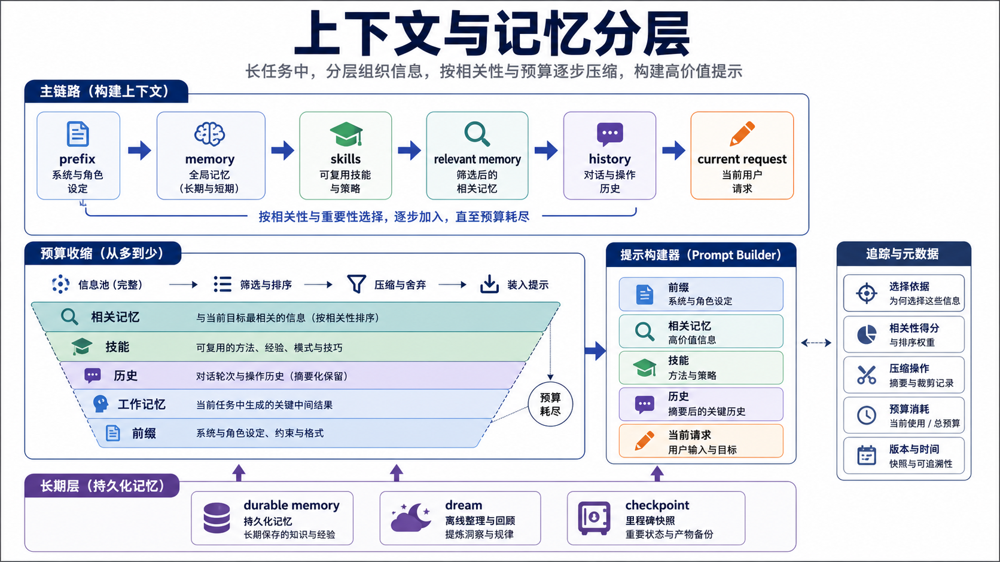

# 上下文、记忆和压缩：长任务里哪些信息该留下

Pico 的上下文设计重点在长任务里的信息寿命分层，不只关心 prompt 写得好不好。当前请求、稳定前缀、工作记忆、相关记忆、历史转录、技能说明，这些信息不应该混成一段字符串。



## ContextManager 是 prompt 的组装器

`pico/core/context_manager.py` 明确把 prompt 拆成六段：

```text
prefix -> memory -> skills -> relevant_memory -> history -> current_request
```

默认总预算是 60000 字符，各段有预算和 floor。超预算时，按这个顺序收缩：

```text
relevant_memory -> skills -> history -> memory -> prefix
```

`current_request` 不裁。这个判断很关键，因为最新用户请求一旦丢语义，保留再多旧上下文都没意义。

这层还有一个容易被低估的点：`build()` 返回的不只是 prompt，还有 metadata。每段原始长度、渲染长度、预算收缩、selected notes、context usage 都会进入 trace/report。也就是说，Pico 不只知道发了什么 prompt，还能解释它为什么长成这样。

## Prefix 是稳定运行时资产

`PromptPrefix` 在 `runtime.py` 里带有：

- `text`
- `hash`
- `workspace_fingerprint`
- `tool_signature`
- `built_at`

Pico 已经不再每轮临时拼一个 system prompt。它在跟踪稳定前缀什么时候可以复用，什么时候因为工具签名、工作区或模式变化需要刷新。

Claude Code 在这层更完整。它把 system prompt parts、tools、model、beta headers、effort、cache strategy 等都当成 prompt cache 相关因素。Pico 目前只把 prefix/hash/fingerprint/tool signature 做出来，还没有更细的 section registry 和 cache break detection。

## Working memory 是当前任务工作面

`pico/features/memory.py` 的 `LayeredMemory` 保存的是一份很小的工作集：

- `task_summary`
- `recent_files`
- `file_summaries`
- `episodic_notes`
- `durable_topics`

它不是知识库。它的作用是让下一轮少重复劳动。比如刚读过的文件会留下短摘要和 freshness，下一轮 `ToolPolicyChecker` 也能用这个 freshness 判断是否允许修改文件。

这点比普通聊天摘要更实用。普通摘要只回答“前面聊了什么”，Pico 的 working memory 还参与工具策略：编辑前必须 fresh read，recent file 和 file summary 都会影响下一轮 prompt 和 policy。

## Relevant memory 是按需召回

`retrieval_candidates()` 没有用 embedding，而是用 tag、关键词重叠和时间排序做简单透明的召回。默认取 3 条。

这个选择不花哨，但符合 Pico 当前定位。它保证行为容易调试，出错时能直接看出为什么某条 note 被选中。代价也明显：语义召回能力弱，跨语言和同义表达不稳。

Claude Code 的 memory 体系更复杂，有 `CLAUDE.md` stack、auto memory、team memory、session memory、background extractor。它不是只做召回，还把不同来源、不同寿命、不同权限的记忆分开管理。Pico 现在学到的是分层思路，还没有做到完整平台形态。

## Durable memory 是文件化长期事实

Pico 的 durable memory 在 `.pico/memory/`，包含 `MEMORY.md` 索引和 topic files。长期记忆不会自动吞掉所有会话内容，只会通过显式 intent、`<memory>` tags、`/remember`、`/dream` 和 auto-dream gate 慢慢进入。

`promote_durable_memory()` 只接受有限格式的稳定事实，比如：

- `Project convention: ...`
- `Decision: ...`
- `Dependency: ...`
- `Preference: ...`

同时会拒绝 secret-shaped 文本、当前目标、下一步、stdout/stderr、过长日志这类不该进长期记忆的内容。

这个口径很重要。长期记忆最危险的问题，是把临时状态、错误日志和秘密都记进去。

## Compact 是历史瘦身，不是 durable memory

`pico/core/compact.py` 按 turn 分组，把旧 turn 变成一条 `compact_summary` system history，只保留最近几个 turn。summary 里会记录目标、读过的文件、改过的文件、关键决策、当前进度和下一步。

它和 durable memory 的职责不同：

- compact 服务当前 session 续航。
- durable memory 服务未来 session。
- working memory 服务下一轮 prompt。

Claude Code 这层更细，有 snip、microcompact、autocompact、post-compact messages、session memory compact。Pico 现在只有手动 compact 和预算触发 checkpoint，仍然偏基础。

## 对标 Claude Code 的差距

| 问题 | Pico 当前做法 | Claude Code 参照 |
| --- | --- | --- |
| 指令记忆 | prefix + skills + memory system section | CLAUDE.md 多层栈，managed/user/project/local，支持 include |
| 工作记忆 | `LayeredMemory` 小状态 | session memory markdown，compact 后继续接现场 |
| 长期记忆 | `.pico/memory/MEMORY.md` + topics | auto memory + team memory，后台 extractor 写入 |
| 压缩 | `CompactManager` 汇总旧 turn | snip、microcompact、autocompact、post-compact cleanup |
| cache | prefix hash 和 provider metadata | cache break detection，system/tools/cache-control 多维解释 |

## 当前取舍

Pico 的上下文治理已经抓住了主线：不同寿命的信息要分开，最新请求不能裁，prompt metadata 必须可审计，记忆不能等于 transcript。

下一步更有价值的改进不是直接上 embedding，可以先补两个更工程化的点：一是把 prefix section 注册表做实，让每段来源、稳定性、缓存影响都可解释；二是把 auto-dream 改成更像 Claude Code 的受限后台 memory writer，减少普通 Pico 子运行时在 memory consolidation 里的权限面。

## 设计文档级补充：context 是运行时资产

对 coding agent 来说，context 不是“把历史拼起来”。它是运行时最贵、最脆弱的资产。拼少了，模型缺关键证据；拼多了，模型被旧信息污染，provider 成本和延迟也上升。

Pico v3 的 ContextManager 要解决三个问题：

1. 哪些信息每轮都必须出现。
2. 哪些信息可以按预算裁剪。
3. 哪些信息应该离开 prompt，进入 memory、compact summary 或 artifact。

### prompt section 的寿命模型

可以按寿命理解 Pico 的 prompt：

| section | 寿命 | 是否应固定注入 | 例子 |
| --- | --- | --- | --- |
| prefix | session/runtime 级 | 是 | 工具规则、runtime identity、workspace 摘要 |
| current request | 当前 turn | 是 | 用户最新输入 |
| runtime mode | 当前模式 | 是 | plan mode、tool profile |
| working memory | session 内 | 是，但可裁 | task summary、recent files |
| relevant memory | query 相关 | 否，按需 | durable note retrieval |
| history | session 内 | 可裁 | 旧 user/assistant/tool turn |
| compact summary | session 内 | 是，替代旧 history | 压缩后的旧 turn |
| durable memory index | 跨 session | 是，短索引 | `.pico/memory/MEMORY.md` |

这个表比“context 里放什么”更重要。不同寿命的信息混在一起，是长任务失控的根源。

### 为什么 durable memory 不能等于 transcript

Reflexion 类研究说明，语言 agent 可以把反馈写成自然语言记忆，在后续尝试中提升决策。但这不意味着要保存所有 transcript。反馈记忆必须是低噪声、高密度、可复用的反思。

Pico 当前的 rejection 规则就是在做这个过滤：secret、stdout/stderr、traceback、当前下一步、过长日志都不该进 durable memory。这和 Dream 文档里的维护逻辑是一套：短期输入流可以脏，长期记忆不能脏。

### compact 的正确边界

Compact 不是总结知识库，它只服务当前会话续航。它应该回答：

- 当前任务是什么。
- 已经读过哪些文件。
- 改过哪些文件。
- 做过哪些关键决策。
- 哪些失败已经排除。
- 下一步从哪里继续。

它不应该回答：

- 用户长期偏好是什么。
- 项目永久架构是什么。
- 依赖事实是否长期成立。
- 这次任务以外的知识整理。

这些应该进入 durable memory 或 release docs。

### 与成熟上下文系统的对应

成熟 coding agent 往往会把上下文分成多层：

- system prompt：长期行为约束。
- user/project instructions：项目和团队协作契约。
- memory attachments：长期索引和 topic 文件。
- transcript tail：最近会话。
- compact boundary：压缩后的旧历史。
- tool result storage：长结果脱离 prompt，只保留引用。
- cache metadata：解释哪些前缀可复用，哪些动态内容会破坏缓存。

Pico v3 已经有 section 和预算，但 section 注册还不够显式。现在很多规则散在 ContextManager 和 Runtime prefix 构建里。下一步应该让每个 section 都能声明：

```text
name
source
lifetime
minimum budget
max budget
cache stability
drop strategy
report metadata
```

这样 context 失败时可以直接从 report 看出哪一段被裁掉，而不是读代码猜。

### 失败模式和防线

| 失败模式 | 当前防线 | 改进方向 |
| --- | --- | --- |
| 最新请求被裁 | current request 不裁 | 保持 hard floor |
| 历史工具结果孤立 | history rendering 折叠 | 增加 tool pair integrity 检查 |
| durable memory 污染 | rejection rules + Dream | 增加 memory review/report |
| prefix 变动导致 cache miss | prefix hash metadata | 记录具体 section diff |
| compact 丢关键文件 | compact prompt 写 files/decisions | 用 run evidence 校验恢复质量 |
| relevant memory 召回噪声 | 简单 token matching | 后续可加 topic-aware retrieval |

### 改进路线

1. **Section registry**：把 prefix、memory、skills、history、todo、runtime mode 都登记成 section spec。
2. **Context report**：每次 run report 记录各 section 原始长度、渲染长度、裁剪原因。
3. **Tool result storage**：统一长输出落盘，不让大结果挤压 history。
4. **Compact verification**：compact 后跑一个轻量检查，确认 task、files、decisions、next step 都存在。
5. **Memory hygiene report**：Dream 后写 changed topics、removed duplicate、replaced stale facts。

### 最小验收清单

一个 context/memory 改动至少要证明：

- 当前请求不被裁剪。
- plan mode、todo、worker notification 能进入 prompt。
- durable memory 不保存 secret-shaped 文本。
- compact 后仍能恢复 task summary 和 touched files。
- report 能解释 prompt section 预算和实际长度。
- 长工具输出不会把 history 挤爆。
