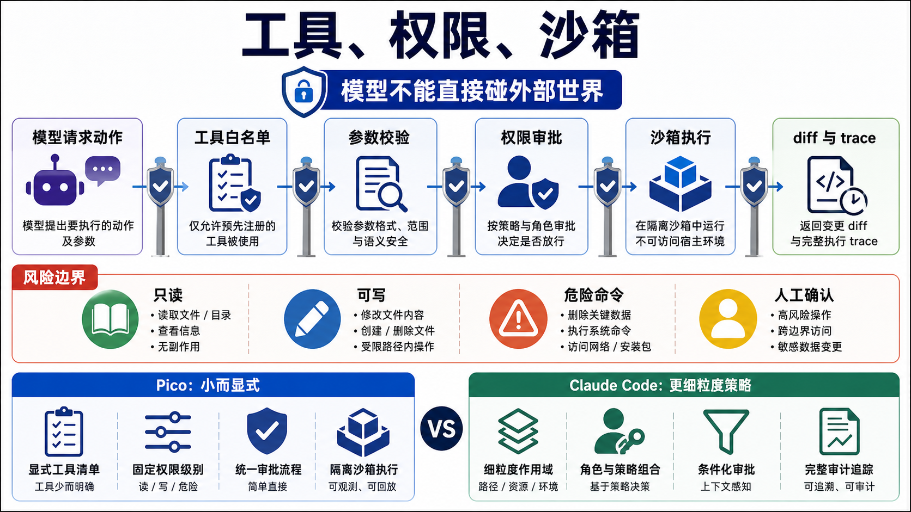

 # 工具、权限和沙箱：模型不能直接碰外部世界

Coding agent 的工具层不能只看工具数量。模型提出一个动作以后，系统要能判断它是否允许、是否合理、是否改变了工作区，以及改变后有没有证据留下。



Pico 当前这一层由四个部分组成：

- `tools/registry.py` 定义工具白名单和参数校验。
- `core/permissions.py` 做运行模式和审批决策。
- `core/tool_policy.py` 做更高层的行为约束。
- `core/tool_executor.py` 把执行、diff、metadata 和 trace 收口。

## 工具 registry 是能力白名单

Pico 的工具走显式注册，不做动态发现。基础工具在 `BASE_TOOL_SPECS` 里定义，包括：

- `list_files`
- `read_file`
- `search`
- `run_shell`
- `write_file`
- `patch_file`
- `todo_add / todo_update / todo_list`
- `agent / send_message / task_stop`
- `enter_plan_mode / exit_plan_mode`
- `ask_user`

每个工具都有 schema、description、risky 标记和 runner。`validate_tool()` 再做路径、参数、timeout、exact match 等具体校验。比如 `patch_file` 要求 `old_text` 精确命中且只能出现一次，这让编辑失败原因可解释，也避免模型用模糊 patch 乱改。

## PermissionChecker 决定能不能做

`PermissionChecker.check()` 先看当前 tool profile。Pico 有几种 profile：

- `default`：完整工具面。
- `plan`：只读工具、计划 artifact 写入、Explore 子 agent、todo、ask_user。
- `dream`：只读工具和 memory 目录写入。
- `readonly`：只读工具。
- `worker`：去掉 coordinator 工具、mode 工具、interactive 工具和 `run_shell`。

然后它继续看运行模式：

- plan mode 下写操作只能写 active plan artifact。
- worker 有 `write_scope` 时只能改 scope 内路径。
- read-only runtime 直接拒绝 risky tool。
- approval policy 是 `auto` 时允许，`never` 时拒绝，`ask` 时走用户确认。

这里的关键判断是，权限由工具、runtime mode、worker scope、approval policy 一起算出来，不能只看工具自己的属性。

## ToolPolicyChecker 决定该不该这么做

权限允许不代表动作合理。`ToolPolicyChecker` 目前有两条很实用的策略：

- `patch_file` 和覆盖已有文件的 `write_file` 需要 fresh `read_file`。
- 普通读文件、搜索、列目录不要绕到 `run_shell`，应该用 `read_file`、`search`、`list_files`。

这已经开始接近 Claude Code 的 tool micro-policy 思路。工具不是只有 schema，还应该有使用协议。比如什么时候必须先读，什么时候不该用 shell，哪些行为属于反模式。

## SandboxRunner 是 shell 的可选隔离层

`features/sandbox/` 现在支持：

- mode：`off`、`best_effort`、`required`
- backend：`auto`、`bubblewrap`、`none`
- workspace 是否可写
- extra readonly paths
- deny read / deny write
- excluded commands

`run_shell` 会通过 `SandboxRunner.run()` 执行。sandbox 不可用时，`required` 直接报错，`best_effort` 会降级到 plain shell 并发出事件。

这层现在偏轻。它能把 shell 执行放进 bubblewrap，但还没有 Claude Code BashTool 那种更完整的 command semantics、destructive warning、read-only validation、sed validation、PowerShell 分支和平台适配。

## tool_executor 让动作可审计

工具执行前后，Pico 会对 risky 工具做工作区快照，执行后计算：

- `affected_paths`
- `workspace_changed`
- `workspace_fingerprint`
- `diff_summary`
- `tool_status`
- `tool_error_code`
- `security_event_type`

长 shell 输出还会写进 run artifact，只在 prompt 里保留截断摘要。这一点和 Claude Code 的 tool result budget 思路类似，只是 Pico 现在只覆盖 `run_shell`。

## 和 Claude Code 的对标

Claude Code 的 `Tool.ts` 把工具定义成更完整的协议：input schema、permission context、progress、UI 渲染、MCP、agent、task、worktree、notebook、LSP 等都在工具系统里。它的工具目录也更细，比如 BashTool 拆出了 command semantics、path validation、read-only validation、sandbox 判断和 destructive warning。

Pico 现在的工具层更小，但主线是对的：

| 维度 | Pico | Claude Code |
| --- | --- | --- |
| 工具注册 | Python dict 显式白名单 | 独立工具模块和工具 registry |
| 权限 | profile + approval + write scope | permission context + hooks + mode handlers |
| 策略 | fresh read、shell 搜索拦截 | 每类工具都有更细的 prompt 和 validation |
| 沙箱 | bubblewrap 可选 | Bash/PowerShell 多层安全语义和平台适配 |
| 结果 | metadata + trace + artifact | progress events、tool result budget、UI/SDK message |

## 当前取舍

Pico 的工具系统适合当前体量。它没有 MCP 和几十个工具，但有统一执行边界，这比盲目堆工具更重要。

后续优先补的是 tool-level policy，而不是工具数量。可以从四件事开始：编辑前 read 规则覆盖更多编辑路径，shell 安全规则按命令语义分类，工具结果统一预算和落盘，worker/plan/dream profile 的边界写成显式测试矩阵。

## 设计文档级补充：tool 是协议，不是函数

工具系统是 coding agent 最容易低估的一层。一个工具看起来只是 Python 函数，但对模型来说，它是接触外部世界的唯一通道。只要工具能读写文件、跑 shell、发网络请求，它就必须被当成协议设计。

Pico v3 的工具协议至少包含七件事：

```text
tool name
input schema
argument validation
permission decision
policy decision
execution
result normalization and evidence
```

少任何一层，agent 都可能在真实仓库里失控。

### registry 的职责边界

`pico/tools/registry.py` 定义工具能力。它应该回答：

- 这个工具叫什么。
- 接受哪些参数。
- 参数是否合法。
- 实际执行函数是什么。
- 是否属于 risky tool。

它不应该独自决定：

- 当前模式能不能用。
- 需不需要用户审批。
- worker 是否越过 write scope。
- 是否违反 read-before-write 策略。
- 工具结果怎么写进 run trace。

这些属于 `tool_executor.py`、`permissions.py`、`tool_policy.py` 和 `run_store.py`。

### permission 和 policy 的区别

权限回答“能不能做”。策略回答“该不该这样做”。

例子：

- `write_file` 在 approval=auto 下可能有权限，但如果没 fresh read 目标文件，策略应该拒绝。
- `run_shell` 在 default profile 下可能有权限，但如果只是 `cat README.md`，策略应该要求用 `read_file`。
- worker 有写权限，但路径不在 write_scope 内，权限应该拒绝。
- plan mode 允许写 active plan artifact，但不允许顺手改源码。

这个拆分非常重要。否则所有规则都会堆进一个 if-else，最后既解释不清，也测不完整。

### sandbox 是最后一道边界

Permission 和 policy 是逻辑边界，sandbox 是执行边界。

```text
permission: 这次工具调用是否允许
policy: 这个工具用法是否合理
sandbox: 即使允许执行，进程最多能碰到哪里
```

Pico 当前 sandbox 只覆盖 `run_shell`，支持 `off/best_effort/required`。在 macOS 上 bubblewrap 不可用，所以它不能作为唯一安全手段。文档和测试里必须把这个边界讲清楚：sandbox 是 defense-in-depth，不是 approval 的替代品。

### 工具结果也是协议

工具返回值不能只是字符串。Pico 需要知道：

- 是否成功。
- 错误码是什么。
- 是否改变 workspace。
- 改了哪些 path。
- 输出是否被截断。
- 长输出 artifact 在哪里。
- 是否触发 security event。

这也是为什么 `tool_status`、`tool_error_code`、`affected_paths`、`diff_summary` 要进入 trace/report。没有这些字段，evaluation 无法判断工具行为是否符合预期。

### 与成熟工具系统的对应

成熟 coding agent 的 tool interface 往往包含：

- schema 和 prompt description。
- permission prompt 文案。
- progress event。
- cancellation behavior。
- concurrency safety。
- result budget。
- UI renderer。
- MCP/deferred loading。
- read/search/write 分类。

Pico 当前只做了小集合，但应该保留协议意识。未来增加 MCP、web、notebook、LSP 之前，先把当前工具的协议边界打稳。

### 失败模式和防线

| 失败模式 | 当前防线 | 缺口 |
| --- | --- | --- |
| 模型绕过 read_file 用 shell 搜索 | shell search/read policy | 命令语义分类还粗 |
| 覆盖文件前没读 | fresh read policy | 需要覆盖 patch/write/edit 全路径 |
| worker 写到 scope 外 | PermissionChecker write_scope | scope 报告还可更清楚 |
| plan mode 偷改源码 | plan profile + active artifact | plan exit gate 可更强 |
| shell 破坏性命令 | approval + sandbox required/best_effort | destructive command classifier 还弱 |
| 大输出挤爆 prompt | run_shell artifact | 其他工具未统一 |
| 重复工具死循环 | repetition guard | 缺少自动换策略提示 |

### 改进路线

1. **ToolSpec 化**：把 schema、validator、runner、risk、examples、result policy 收成统一对象。
2. **Policy matrix**：按 tool/profile/runtime mode 列出允许、拒绝和需要审批的组合。
3. **Command semantics**：shell 不只看字符串黑名单，而是解析 command role：test、install、read、search、destructive、network。
4. **Result budget**：所有工具统一短输出、长 artifact、摘要引用。
5. **Permission evidence**：report 里聚合 permission denied、policy denied、security events。

### 最小验收清单

工具层改动必须证明：

- 未知工具被拒绝并写 trace。
- risky 工具执行前后有 workspace diff。
- read-before-write 对覆盖和 patch 都有效。
- shell search/read 反模式被拦截，合法 pipe 截断不被误杀。
- worker write_scope、plan artifact、dream memory scope 都有测试。
- 长输出落盘后 prompt 只保留摘要和 artifact path。
