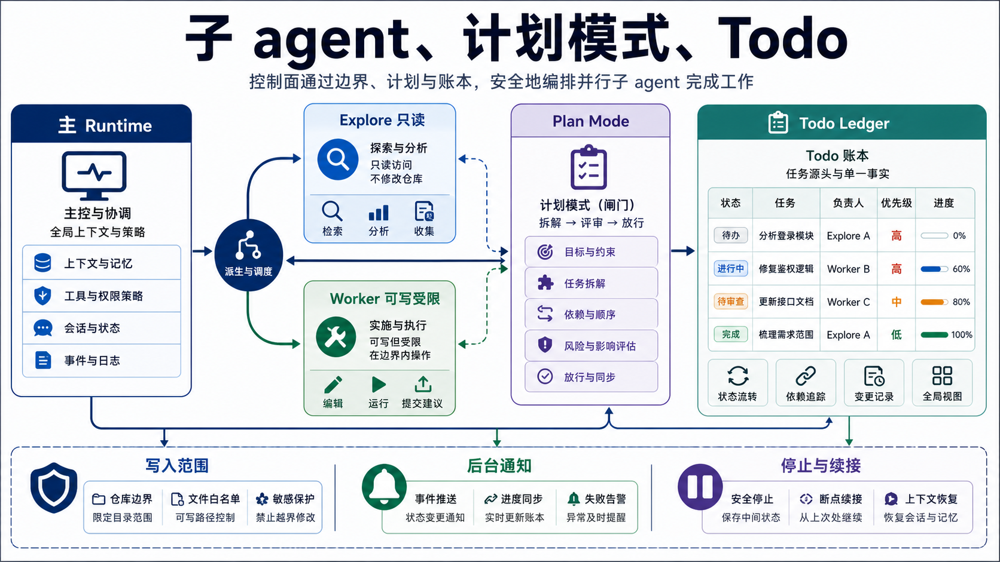

# 子 agent、计划模式和 Todo：控制面怎么长出来

Pico 的子 agent 是主 runtime 下面的受限 child run。它解决长任务里的分工问题：主 agent 不应该把所有探索、修改和跟进都塞在一个上下文里，子 agent 也不能变成没有边界的第二个全能 agent。



## WorkerManager 管生命周期

`pico/core/worker_manager.py` 负责 worker 的生命周期：

- `spawn()` 创建任务。
- `continue_task()` 续接 idle worker。
- `stop_task()` 请求停止。
- `drain_notifications()` 把 worker 完成消息注入主 history。
- `shutdown()` 退出时请求后台 worker 停止。

每个 worker 是一个 `WorkerTask`，包含 id、description、subagent_type、write_scope、child runtime、thread、stop flag 和 runtime state。

最关键的是 `_new_task()`。它会调用 `build_child_runtime()` 生成一个新的 `Pico` 子 runtime，而不是只把 prompt 传给同一个 agent。

## Explore 和 worker 的边界

Pico 现在支持两类子 agent：

- `Explore`：只读，approval policy 是 `never`，tool profile 是 `readonly`。
- `worker`：可写但必须受 `write_scope` 约束，tool profile 是 `worker`，并且不暴露 `run_shell`。

plan mode 下只能启动 `Explore`。这是一个很重要的边界，因为计划阶段应该允许调查，但不应该通过子 agent 绕过写限制。

## 后台执行靠 model_client_factory

`WorkerManager._can_run_background()` 要求 parent 有 `model_client_factory`。如果有 factory，就起 thread 后台跑；如果没有，就同步跑。

这个设计有一个实际原因：同一个 model client 未必线程安全，也未必能并发请求。child runtime 应该拿新的 client。没有 factory 时同步执行虽然慢，但行为更可控。

## send_message 是续接同一个 child runtime

`send_message` 不只是新开一次任务。`continue_task()` 会找到 active worker task，用同一个 child runtime 继续跑。这样 child 的 history、memory、tool state 才能延续。

这比“每次 send_message 都重新 spawn 一个 agent”更接近真实协作。主 agent 可以先让 Explore 查入口，等结果回来后继续问它更窄的问题。

## worker notification 回到主循环

`worker_execution.py` 跑完 child runtime 后，会把结果、tool_steps、attempts、worker artifacts、duration 写回 worker item，再放入 notification queue。主 `Engine` 在模型请求前、工具后、final 前都会 drain notifications，并把通知记录进主 history。

这让后台 worker 不只是默默完成。它的结果会进入主 agent 后续 prompt，主 agent 能基于这些结果继续决策。

## Plan mode 是写边界，不只是提示词

`pico/core/plan_mode.py` 进入计划模式后，会把 session 的 `runtime_mode` 改成：

```text
mode: plan
topic: ...
plan_path: .pico/plans/<topic>-plan.md
```

同时切换 tool profile 到 `plan`，刷新 prefix。plan 模式下：

- 可以读文件。
- 可以用 todo。
- 可以启动 Explore。
- 写操作只能写 active plan artifact。
- final 前必须保证 plan artifact 非空。

这个设计比单纯在 prompt 里说“你现在在计划模式”更强，因为真正的写边界在 `PermissionChecker` 里执行。

## TodoLedger 是运行时任务账本

`pico/core/todo_ledger.py` 管 session-scoped todo。它支持 `pending / in_progress / done / blocked` 和 `low / normal / high`，每次 add/update 都会写 session、发 event，并记录到当前 `TaskState.todo_changes`。

Todo 会进入 `ContextManager` 的 memory section。模型下一轮能看到当前任务账本，run report 也能记录 todo 变化，所以它不是 UI 装饰。

## 和 Claude Code 的对标

Claude Code 在这一层明显更大。它有 `AgentTool`、`SendMessageTool`、`TaskCreateTool`、`TaskUpdateTool`、`TaskStopTool`、TeamCreate/TeamDelete、local/remote/in-process teammate、worktree 模式和任务输出文件。`Task.ts` 里 task type 也更细，能区分 local bash、local agent、remote agent、workflow、monitor、dream。

Pico 当前只做了最小控制面：

| 维度 | Pico | Claude Code |
| --- | --- | --- |
| 子 agent 类型 | Explore / worker | local agent、remote agent、in-process teammate、team |
| 续接 | `send_message` 续接 child runtime | resume agent、teammate mailbox、task output |
| 停止 | stop flag + abort child turn | task kill、interrupt、terminal state |
| 写边界 | worker `write_scope`、plan artifact | permission context、worktree、scratchpad、agent-specific context |
| 任务账本 | TodoLedger session 状态 | Task tools、TaskList UI、disk output |

## 当前取舍

Pico 的子 agent 设计最值得保留的点是边界清楚：Explore 只能读，worker 不能 shell，写入必须有 scope，plan mode 不能启动 worker。这个取舍比一开始做复杂多 agent 协作更重要。

下一步可以补三层：一是 worker output artifact 更系统地纳入主 report；二是 worker 的 tool profile 再细分，比如允许测试但不允许任意 shell；三是 plan mode 和 todo ledger 形成更明确的交付门槛，比如计划项必须全部 done 或有 blocked reason 才允许退出计划。

## 设计文档级补充：复杂任务的控制面

单 agent loop 最大的问题不是不能完成任务，而是所有状态都挤在同一个上下文里。探索、计划、修改、验证、复盘、子任务结果全部混在一起时，模型很容易忘记边界。

Pico v3 引入 plan、todo、worker，本质是在主循环外面建立复杂任务控制面。

```text
Plan mode: 限制写入范围，先形成计划 artifact
Todo ledger: 把任务拆分变成 session state
Worker manager: 把子任务放进受限 child runtime
Notification queue: 把子任务结果回流主循环
```

### Plan mode 为什么必须是 runtime mode

如果 plan mode 只是 prompt 文案，模型仍然可能调用写工具改源码。Pico 的设计是把 plan mode 写进 runtime state，并切换 tool profile。

这带来三个效果：

- 权限层能识别当前是 plan mode。
- 写操作只能落到 active plan artifact。
- final 前可以检查 plan artifact 是否存在内容。

这个设计比“请先制定计划”可靠，因为约束在工具边界执行，而不是只靠模型自觉。

### TodoLedger 为什么不是 UI 装饰

Todo 如果只显示在 TUI，模型下一轮不一定看得到。Pico 的 TodoLedger 是 session state：

- add/update 会写 session。
- todo changes 会进入 TaskState。
- todo view 会进入 prompt。
- report 能看到 todo 变化。

这让 todo 成为控制面的一部分。它帮助模型在长任务里维持任务分解，而不是让用户在脑子里记。

### Worker 是受限 child runtime

Pico 的 worker 不是“另一个完全自由的 agent”。它是由 parent runtime 构造出来的 child `Pico`，带着更窄的工具 profile 和写边界。

当前有两类：

| 类型 | 权限 | 适合场景 |
| --- | --- | --- |
| Explore | readonly，approval never | 计划阶段调查代码、找入口、读文档 |
| worker | 可写但有 write_scope，不暴露 shell | 执行明确子任务 |

这个边界能防止两个问题：

- plan mode 通过子 agent 绕过写限制。
- worker 在没有 scope 的情况下变成第二个主 agent。

### notification 回流是协作的关键

子 agent 结果如果只写在自己上下文里，主 agent 不会自然知道。Pico 通过 notification queue 把 worker 完成消息注入主 history/prompt。

这件事看起来像 UI 细节，其实是多 agent 协作的核心。主 agent 必须看到：

- 哪个 worker 完成了。
- 做了什么。
- 是否成功。
- 有哪些 artifact。
- 是否需要继续追问。

否则 worker 只是后台脚本，不是协作单元。

### 和成熟任务系统的对应

成熟 coding agent 的任务系统通常有更完整的 task lifecycle：

```text
created -> queued -> running -> waiting -> completed/failed/canceled/archived
```

任务对象可能有 output file、owner、parent tool use id、remote/local type、UI progress、kill handler、resume handle。Pico 当前只有轻量 WorkerTask 和 TodoLedger，但已经覆盖了最小必要边界：spawn、continue、stop、notification、write_scope。

### 失败模式和防线

| 失败模式 | 当前防线 | 缺口 |
| --- | --- | --- |
| plan mode 下直接改源码 | plan profile + permission | plan artifact 质量检查弱 |
| worker 越权写文件 | write_scope | scope diff/report 可更强 |
| 子任务完成主 agent 不知道 | notification drain | prompt budget 下 notification 可能被挤压 |
| worker 卡住 | stop flag + shutdown | 没有完整 task timeout 和 heartbeat |
| todo 变成形式主义 | prompt 注入 + task_state | 没有 done/blocked exit gate |
| 多 worker 互相冲突 | write_scope 约束 | 没有 worktree 隔离 |

### 改进路线

1. **Task lifecycle**：把 WorkerTask 状态扩展成 queued/running/waiting/completed/failed/canceled。
2. **Worker output contract**：每个 worker 必须生成 summary、changed_paths、artifacts、follow-up question。
3. **Plan exit gate**：退出 plan mode 前检查计划结构、scope、verification path。
4. **Todo completion gate**：final 前如果 todo 未完成，要求 blocked reason 或 continuation plan。
5. **Worktree worker**：大改动 worker 使用隔离 worktree，减少并行冲突。

### 最小验收清单

这层改动至少要验证：

- plan mode 可以读和写 plan artifact，但不能写普通源码。
- Explore 在 plan mode 可用且只读。
- worker 必须受 write_scope 限制。
- `send_message` 续接同一个 child runtime，而不是重开任务。
- `task_stop` 能让 worker 进入停止流程。
- worker 完成通知会进入主循环可见上下文。
- todo changes 写进 task_state/report。
