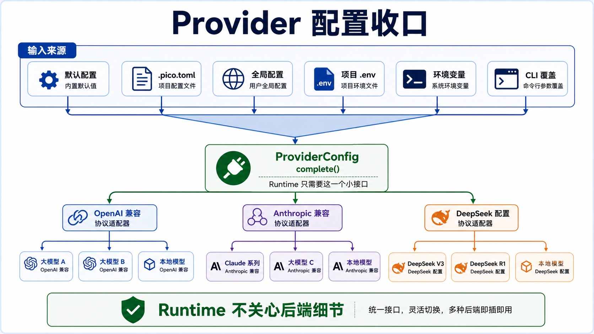

# Provider 和配置：Runtime 只面对一个小接口

Pico 的 provider 层目标很克制：runtime 不应该知道某个后端走 `/responses` 还是 `/messages`，不应该自己解析 SSE，也不应该关心 usage 字段叫 `input_tokens` 还是 `prompt_tokens`。runtime 只要一个 `complete()`。



## 配置入口

`pico/config/__init__.py` 负责把配置来源收敛成 `ProviderConfig`：

- 默认配置：`openai`、`anthropic`、`deepseek`
- 项目配置：`.pico.toml`
- 全局配置：`~/.config/pico/config.toml`
- 项目 `.env`
- 环境变量
- CLI 参数覆盖

provider 和 protocol 分开。比如 `deepseek` 是 provider profile，但 protocol 当前是 `anthropic`。runtime 需要的是协议 client，而不是 provider 的营销名字。

## CLI 做对象装配

`pico/cli.py` 的 `_build_model_client()` 读取 `ProviderConfig` 后，只做一件事：根据 protocol 创建 client。

- `protocol=openai` -> `OpenAICompatibleModelClient`
- `protocol=anthropic` -> `AnthropicCompatibleModelClient`

`build_agent()` 还会根据 provider profile 设置默认 `max_new_tokens`。Anthropic 默认更大，OpenAI/DeepSeek 较小。这个默认值不在 runtime 里散落，而是收在 config 层。

## OpenAI-compatible client

`OpenAICompatibleModelClient` 使用 `/responses` 接口，支持：

- JSON 返回
- SSE 返回
- `output_text`
- `output[].content[].text`
- Chat Completions 兼容结构里的 `choices[].message.content`
- usage 和 cache details 抽取
- prompt cache key / retention
- retryable HTTP status 和 transport error 重试

它还会把 provider metadata 统一成：

- `provider_protocol`
- `provider_model`
- `provider_base_url`
- `provider_attempts`
- `provider_retry_count`
- `input_tokens`
- `output_tokens`
- `total_tokens`
- `cached_tokens`
- `cache_hit`

这些字段最后会一路传回 `Engine`，进入 prompt metadata、trace 和 report。

## Anthropic-compatible client

`AnthropicCompatibleModelClient` 使用 `/messages` 接口，输入是单条 user message，输出从 `content[type=text]` 抽取。它也走同一套 `_request_with_retries()` 和 metadata 结构，但目前不支持 prompt cache。

这层设计的好处是，runtime 不关心协议差异。坏处是 Pico 目前没有用 Anthropic 原生 tool use，而是统一走文本协议，所以 provider 的结构化能力没有被充分利用。

## 错误处理是 provider 层的第一道可靠性

`_request_with_retries()` 对 408、409、425、429、5xx 和 transport error 做有限重试。失败会抛 `ProviderError`，其中包含 provider、model、base_url、code、HTTP status、retryable、attempts、body excerpt 和 cause type。

`Engine` 目前只对 `empty_response` 做一次额外 retry。这个策略很保守，避免不可见重试太多导致用户不知道系统卡在哪里。

## Secret redaction

provider 配置和 shell 环境里都有敏感信息风险。CLI 会收集一组 secret env names，runtime 通过 `RuntimeSecretsMixin` 在 trace/report 里做 redaction。`run_shell` 也不会直接继承完整父 shell 环境，而是只传 allowlist 环境变量。

这个边界很实际。Provider 层不仅是发请求，也要保证运行证据不会把 key 写进磁盘。

## 和 Claude Code 的对标

Claude Code 的 API 层比 Pico 更像可靠性控制面。它有 streaming、usage/cost tracking、retry 分类、prompt cache、预算控制、slow operation、feature flag、模型 override 和 telemetry。`QueryEngine` 还会维护 total usage、permission denials、SDK status 和 session transcript。

Pico 当前更轻：

| 维度 | Pico | Claude Code |
| --- | --- | --- |
| API 形态 | blocking `complete()` | streaming query loop 和 SDK messages |
| 重试 | provider 层有限重试，Engine 额外重试 empty response | 分类重试、watchdog、budget 和状态事件更完整 |
| usage | provider metadata 进 trace/report | cost tracker、model usage、API duration、telemetry |
| cache | OpenAI-compatible prompt cache key | cache control、break detection、多维 cache 元数据 |
| 配置 | `.pico.toml`、`.env`、环境变量、CLI | config、managed settings、GrowthBook、feature gates |

## 当前取舍

Pico 的 provider 抽象适合当前阶段：统一接口、统一 metadata、统一错误形状，先让 runtime 不被协议细节污染。

后续最该补的是可靠性而不是 provider 数量。比如流式响应的 idle watchdog、分类 retry budget、provider 降级策略、cache miss 原因记录、模型行为回归档案。这些比再加一个 OpenAI-compatible profile 更能提升 harness 稳定性。

## 设计文档级补充：provider 是可靠性控制面

Provider 层很容易被误解成“封装 API key 和 base_url”。对 runtime harness 来说，它应该承担更大的责任：协议转换、错误分类、usage 抽取、重试、cache metadata、secret redaction。

Pico v3 的目标是让 runtime 面对一个小接口：

```text
complete(prompt, max_new_tokens, prompt_cache_key, prompt_cache_retention)
  -> ModelResult(text, metadata)
```

这个接口越小，runtime 越不容易被 provider 细节污染。

### 配置合并是 provider 层的第一步

Pico 的配置优先级是：

```text
CLI explicit args
  > environment variables
  > project .pico.toml
  > global config
  > defaults
```

这里有两个关键点：

第一，provider profile 和 protocol 分开。`deepseek` 可以是 profile 名，但真正决定 client 的是 `protocol`。

第二，`.env` 和 `.pico.toml` 是项目本地入口。这样 release 和测试能复用真实配置路径，而不是靠 shell 临时 export。

### 为什么不让 Engine 直接知道协议

如果 Engine 直接知道 OpenAI `/responses`、Anthropic `/messages`、DeepSeek 兼容路径，会有三个坏结果：

- 主循环里出现 provider 分支。
- usage/error/cache metadata 形状不统一。
- 测试必须模拟多个协议。

所以 provider 层应该把差异压成统一 metadata：

```text
provider_protocol
provider_model
provider_base_url
provider_attempts
provider_retry_count
input_tokens
output_tokens
total_tokens
cached_tokens
cache_hit
```

这些字段最后进入 trace/report，形成证据链。

### 错误分类决定用户体验

ProviderError 不能只是一段异常字符串。它至少要说明：

- provider 是谁。
- model 是谁。
- base_url 是谁，且不能泄漏 secret。
- HTTP status 或 transport error 是什么。
- 是否 retryable。
- 试了几次。
- body excerpt 是否可展示。

这决定 Engine 能不能给用户一个有用的停止原因，而不是“模型失败了”。

### prompt cache 和配置稳定性

成熟 agent 很重视 prompt cache，不只是为了省钱，也为了降低长任务延迟。Pico 现在已有 prompt_cache_key / retention 的入口和 provider metadata，但还缺少 cache miss 解释。

后续可以把 cache 相关问题分成三类：

- prefix 内容变化导致 cache miss。
- tool/profile/skill signature 变化导致 cache miss。
- provider 不支持或未返回 cache metadata。

这些都应该进入 run report。

### 外部设计参照

Managed Agents 的 Dreams 文档把异步 job、usage、status、error、output resource 都作为一等资源暴露。这说明 provider/API 层不只是“发请求”，它还要表达生命周期、成本和失败。Pico 虽然不是托管平台，但 provider 和 run report 也应该尽量保留这些信息。

### 失败模式和防线

| 失败模式 | 当前防线 | 改进方向 |
| --- | --- | --- |
| API key 泄漏进 trace | RuntimeSecretsMixin redaction | 增加 redaction test matrix |
| base_url 配错 | ProviderError metadata | 增加 config diagnose 命令 |
| 429/5xx 短暂失败 | `_request_with_retries()` | 分类 retry budget 和 backoff report |
| 空响应 | Engine empty_response retry | streaming watchdog 和 provider-specific diagnosis |
| usage 字段缺失 | metadata best effort | report 标注 unknown 而非 0 |
| prompt cache miss 不可解释 | cache metadata | section signature diff |
| provider 协议能力浪费 | 文本协议统一 | 后续可选原生 tool-use adapter |

### 改进路线

1. **Provider capability matrix**：记录每个 provider 是否支持 streaming、cache、usage、native tools。
2. **Streaming adapter**：在不破坏 `ModelResult` 的前提下引入 provider event stream。
3. **Retry policy object**：把 retryable status、transport error、max attempts、delay 全部配置化并写 report。
4. **Config doctor**：检查当前 profile、protocol、base_url、model、key 来源和 masked 状态。
5. **Model behavior archive**：release 时保存 provider smoke 输出和 failure category，避免模型升级后无证据。

### 最小验收清单

Provider 改动至少验证：

- `.pico.toml`、`.env`、环境变量、CLI override 优先级正确。
- OpenAI-compatible 和 Anthropic-compatible 都返回统一 `ModelResult`。
- 429/5xx/transport error 会重试并记录 retry_count。
- API key 不出现在 task_state/trace/report。
- usage/cache metadata 缺失时不误报。
- model error 能变成用户可读诊断和明确 stop_reason。
