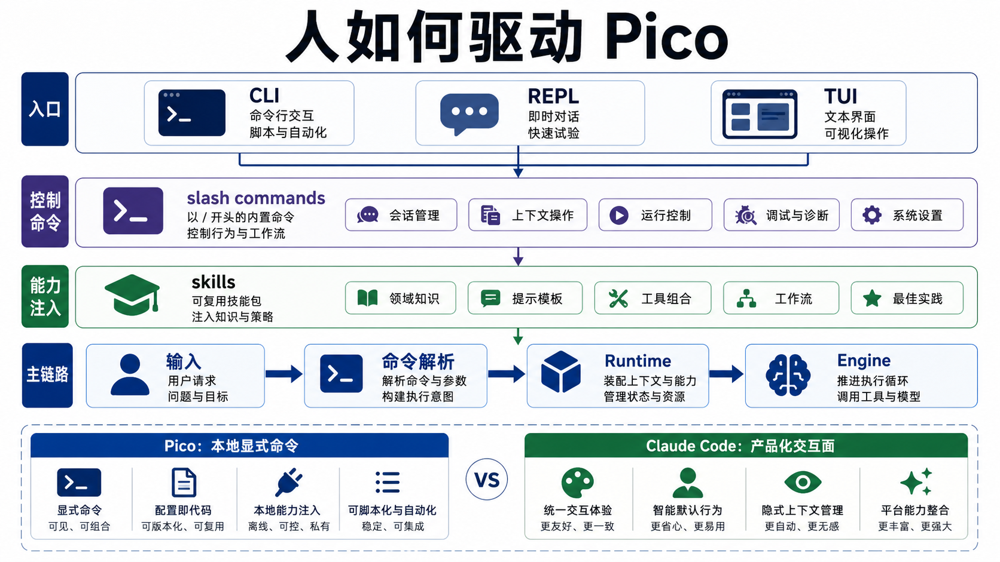

# Skills、命令、CLI 和 TUI：人怎么驱动 Pico

Pico 的交互层分两条线。CLI/REPL/TUI 负责把人的输入送进 runtime，skills 和 slash commands 负责把常见行为变成可触发的工作流。它们都不是主循环本身，但会直接影响模型看到什么、能做什么。



## CLI 是启动装配层

`pico/cli.py` 做三件事：

1. 解析参数。
2. 解析 provider、sandbox、secret env、session resume、memory dir。
3. 调 `build_agent()` 装配出 `Pico`。

然后根据 `interaction_mode()` 选择：

- one-shot：把 prompt 直接交给 `agent.ask()`。
- plain REPL：循环读 input。
- TUI：启动 `PicoTuiApp`。

这个边界很清楚。CLI 不直接实现 agent loop，它只负责把启动参数翻译成 runtime 对象图。

## Slash commands 是本地控制命令

`pico/commands/slash.py` 定义命令元信息，`handle_repl_command()` 执行具体行为。常用命令包括：

- `/memory`
- `/working-memory`
- `/remember`
- `/dream`
- `/skills`
- `/plan`
- `/plan-exit`
- `/session`
- `/agents`
- `/subagent`
- `/context`
- `/usage`
- `/model`
- `/history`
- `/resume`
- `/compact`

这里要注意，slash command 不都进模型。有些命令是纯本地控制，比如 `/history`、`/session`；有些会改变 runtime 状态，比如 `/plan`、`/model`、`/compact`；skills 则会把 workflow prompt 注入执行。

## Skills 是 prompt-driven 工作流

`pico/features/skills.py` 的 skill loader 会从三类路径加载：

- `~/.pico/skills`
- 项目 `skills/`
- 项目 `.pico/skills/`

内置技能来自 `features/skills_bundled.py`。外部 skill 用 Markdown frontmatter：

```markdown
---
name: audit
description: Audit a file
user-invocable: true
---

Audit $ARGUMENTS for risky changes.
```

Pico 支持的 metadata 更丰富，包括 context、allowed_tools、argument_hint、disable_model_invocation、model、paths 等。当前核心路径仍然是 prompt-driven：skill 被选中后变成 prompt 指令，告诉模型如何组合已有工具。

这点和常见的 skill 文档机制很接近。Skill 不给 Agent 新工具，它告诉 Agent 怎样用已有工具完成一类任务。

## Skills 怎么进入 prompt

`ContextManager` 里有独立的 `skills` section。`render_prompt_section()` 会把可见 skills 渲染成：

```text
Available skills:
- /review: ...
- /test: ...
```

Pico 的默认策略是先暴露可用入口，不把所有 skill 正文都塞进 prompt。具体 skill 执行在 `features/skills_runtime.py`，由 slash command `/skill <name> [args]` 或直接 `/skill-name` 路径触发。

Claude Code 在这层更成熟。它有 `SkillTool`、`loadSkillsDir.ts`、bundled skills、dynamic skill discovery prefetch、plugins 贡献 skills，以及更明确的 progressive disclosure。也就是启动时不把所有正文塞进去，模型或用户需要时再展开。

Pico 目前已经有 progressive disclosure 的雏形，但还没有做到 Claude Code 那种技能发现、工具执行、插件系统、动态目录触发的一整套闭环。

## TUI 是 presentation layer

`pico/tui/app.py` 用 Textual 包了一层 UI。它不重新实现运行时，而是调用同一个 `agent.engine.run_turn()` generator。运行时事件会被映射成：

- model requested -> thinking detail
- model parsed -> thinking detail
- tool call -> ToolCard
- tool result -> ToolCard success/error
- worker notification -> assistant message
- final / retry / runtime_notice -> assistant message

审批和 ask_user 也通过 TUI callback 接回 runtime。TUI 只是展示和交互面，权限判断仍在 `PermissionChecker` 和 runtime 里。

## 和 Claude Code 的对标

Claude Code 的交互层是 React/Ink，加上 bridge、remote、desktop handoff、voice、vim mode、MCP 管理、plugin UI 等。`commands.ts` 管大量 slash command，`components/` 管完整终端 UI，`bridge/` 管 IDE 和远程会话。

Pico 当前范围小很多：

| 维度 | Pico | Claude Code |
| --- | --- | --- |
| CLI | argparse + one-shot/REPL/TUI | Commander.js + React/Ink + SDK/headless |
| 命令 | 小型 slash registry | 约几十个命令，覆盖配置、MCP、review、commit、memory、remote |
| Skill | Markdown loader + prompt section + runtime invoke | SkillTool、bundled/project/user/plugin skills、动态发现 |
| UI | Textual widgets，展示事件流 | Ink components，完整消息、审批、状态、diff、context 可视化 |
| Remote/Bridge | 无 | IDE bridge、remote session、desktop/mobile handoff |

## 当前取舍

Pico 的交互层应该保持轻。它要展示本地 harness 的关键反馈：当前模型、approval、工具调用、工具结果、worker notification、context usage、session 状态。

后续如果补强 skills，优先做两件事：一是 skill 正文按需展开，而不是只列入口；二是 skill metadata 和 tool profile 绑定，比如某些 skill 只能用只读工具，某些 skill 可以开 worker。这样 skills 才会从 prompt 文档变成可治理的 workflow。

## 设计文档级补充：用户入口也是控制面

CLI、slash command、skill、TUI 看起来像产品外壳，但在 agent 系统里，它们会直接改变 runtime 行为。入口层如果设计不好，模型会拿不到正确上下文，用户也不知道系统处在什么状态。

Pico v3 的入口层可以分成四类：

```text
CLI: 启动和配置装配
slash command: 本地控制命令
skill: prompt-driven workflow
TUI: runtime event presentation and callbacks
```

### CLI 是 object graph assembler

`pico/cli.py` 不应该实现 agent loop。它的职责是把用户启动参数翻译成 runtime object graph：

- provider config
- sandbox config
- approval policy
- secret env names
- workspace root
- session resume
- memory dir
- model client factory
- one-shot / REPL / TUI mode

这个边界很重要。CLI 如果开始直接处理工具执行或 memory maintenance，就会和 runtime 产生第二套状态。

### slash command 分两类

Pico 的 slash command 不是都给模型看的。它们可以分成两类：

| 类型 | 例子 | 行为 |
| --- | --- | --- |
| local control | `/history`、`/session`、`/model`、`/usage` | 直接读取或修改 runtime 状态，不进入模型 |
| workflow trigger | `/plan`、`/dream`、skill 命令 | 改变 runtime mode 或注入 workflow prompt |

这个分类决定命令实现位置。local control 应该保持确定性；workflow trigger 才需要把指令交给模型。

### Skill 是 workflow，不是 tool

Tool 给模型原子动作。Skill 给模型行为编排。

Skill 的设计重点不是“能不能加载 Markdown”，而是：

- 启动时只暴露 metadata，避免 prompt 膨胀。
- 调用时展开正文，形成一次 workflow。
- metadata 能限制工具面、模型、paths、context 模式。
- skill invocation 应该进入 trace 或 session event，方便复盘。

Pico 现在已有 progressive disclosure 的雏形：prompt section 先列技能入口，具体 skill 由 runtime invoke 展开。下一步应该把 `allowed-tools` 和 tool profile 接起来，让 skill 不只是提示词，而是可治理 workflow。

### TUI 必须消费 runtime events

TUI 的关键原则是：UI 不做 runtime 决策。

它应该只做三件事：

1. 把用户输入送入 runtime。
2. 把 runtime event 渲染成消息、工具卡、状态栏。
3. 把 approval 和 ask_user callback 回传 runtime。

只要 TUI 开始自己判断工具能不能执行，或者自己维护一套 task state，就会和 CLI/REPL 行为分叉。

### 与成熟交互层的对应

成熟 coding agent 的交互层通常还包括：

- IDE bridge。
- remote session。
- mobile/desktop handoff。
- command registry with feature gates。
- skill/plugin discovery。
- permission prompt UI。
- diff viewer。
- context visualization。
- cost/usage display。

Pico 不需要一次性复制这些，但可以学习一个原则：所有入口最终都应该落到同一个 runtime event contract。CLI 打印、TUI 渲染、report 生成、测试断言都消费同一条事件流。

### 失败模式和防线

| 失败模式 | 当前防线 | 改进方向 |
| --- | --- | --- |
| CLI 和 TUI 行为不一致 | 复用 `Engine.run_turn()` | 固化 runtime event schema |
| slash command 绕过权限 | command 只改 runtime 状态 | 命令权限矩阵 |
| skill 正文污染长期 prompt | metadata 先展示 | skill body 按需展开 |
| skill 可用工具过宽 | allowed_tools metadata | 接入 tool profile |
| approval callback 卡 UI | TUI callback | 增加超时/取消语义 |
| 用户不知道当前模式 | mode/status command | TUI/REPL 统一状态栏 |

### 改进路线

1. **Command taxonomy**：所有 slash command 标注 local/workflow/mode/evidence。
2. **Skill invocation trace**：记录 skill name、source、arguments、allowed tools、expanded paths。
3. **Skill profile binding**：skill metadata 可以绑定 readonly/plan/worker/default profile。
4. **Runtime event contract**：TUI 和 CLI 不再各自拼状态文案。
5. **Context visualization**：`/context` 展示 section budget、memory、skills、history 裁剪。

### 最小验收清单

入口层改动至少验证：

- one-shot、REPL、TUI 都走同一个 runtime。
- local slash command 不调用模型。
- skill invocation 会按需展开正文。
- TUI approval/ask_user 能回到 PermissionChecker/runtime。
- `/model`、`/usage`、`/session` 读到的是 runtime 真实状态。
- skill 限制工具面时，模型看不到越权工具。
