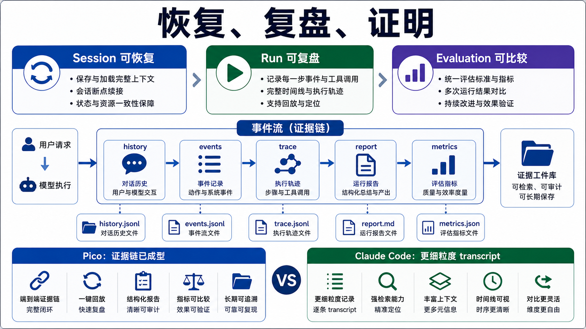

# Session、Run 和 Evaluation：系统怎么恢复、复盘和证明

Pico 的证据层有三个层次：session 让系统能继续工作，run artifacts 让一次请求能被复盘，evaluation 让版本之间能比较。没有这三层，agent 项目很容易变成演示能跑、出了问题说不清。



## SessionStore 管可恢复会话

`pico/core/session_store.py` 负责 `.pico/sessions/<id>.json` 和 `.events.jsonl` 路径。session JSON 保存的是会话级状态：

- history
- memory
- checkpoints
- runtime mode
- workers
- todos
- workspace root

`latest()`、`list_sessions()`、`load()`、`save()` 支持 `/resume` 和 `/history`。写入用临时文件加 `os.replace()`，避免留下半截 JSON。

Claude Code 对这层更激进。它会在用户消息进入 query loop 前先写 transcript，防止进程在 API 返回前被杀时无法 resume。Pico 目前也有 session 和 event 文件，但中途持久化策略没有 Claude Code 那么细。

## SessionEventBus 管事件流

Runtime 会把 session 事件写到 `.events.jsonl`。这些事件包括：

- session started
- turn started / finished
- model requested / parsed
- tool started / finished
- permission decision
- tool policy decision
- worker started / finished
- runtime mode changed
- memory maintenance

事件流和 run trace 不完全相同。session events 更像会话级 timeline，run trace 更像某次请求的审计记录。

## RunStore 管单次请求工件

`pico/core/run_store.py` 每次 `ask()` 开一个 run 目录：

```text
.pico/runs/<run_id>/
  task_state.json
  trace.jsonl
  report.json
  artifacts/
```

`task_state.json` 是运行中会不断覆盖的状态快照。`trace.jsonl` 是 append-only 事件序列。`report.json` 是结束后的聚合摘要。长工具输出可以写到 `artifacts/`。

这三类文件的分工很清楚：

- `task_state` 回答现在跑到哪了。
- `trace` 回答每一步发生了什么。
- `report` 回答这次 run 最后怎么收口。

## TaskState 是运行状态机

`pico/core/task_state.py` 记录：

- `run_id`
- `task_id`
- `user_request`
- `status`
- `tool_steps`
- `attempts`
- `last_tool`
- `stop_reason`
- `final_answer`
- `checkpoint_id`
- `resume_status`
- `changed_paths`
- `artifact_graph`
- `verifier_suggestions`
- `runtime_reminders`
- `todo_changes`

这里要注意 status 和 stop_reason 分开。`completed/stopped/failed` 是状态，`final_answer_returned/step_limit_reached/retry_limit_reached/model_error/...` 是为什么停下。这样 benchmark 和排障都能更准确分类。

## Evaluation 是 deterministic harness

`pico/evaluation/evaluator.py` 用固定 benchmark、fixture repo 和 `ScriptedModelClient` 跑 deterministic 任务。它验证 runtime 行为是否稳定，不把模型能力混进来。

benchmark task 包含：

- id
- prompt
- fixture_repo
- allowed_tools
- step_budget
- expected_artifact
- verifier
- category

`ScriptedModelClient` 让模型输出固定 `<tool>` 和 `<final>`，从而把测试焦点放在 runtime、工具策略、权限、记忆、checkpoint 和 report 上。

`metrics.py` 再从 benchmark artifact 和 `.pico/runs/` 聚合：

- pass rate
- tool steps
- attempts
- prompt chars
- cache hit rate
- cached token ratio
- prefix reuse rate
- tool status counts
- security event counts
- stop reason counts
- run/tool/prompt duration

## 和 Claude Code 的对标

Claude Code 的证据层更接近产品观测系统。它有 transcript、SDK messages、cost tracker、usage、token budget、telemetry、feature flags、query profiling、compact boundary、remote session 事件、tool progress messages。

Pico 的证据层更适合本地 harness：

| 维度 | Pico | Claude Code |
| --- | --- | --- |
| 会话恢复 | session JSON + events JSONL | transcript + session storage + SDK message adapter |
| 单次 run | task_state / trace / report | query events、tool progress、usage、telemetry |
| 评测 | fixed benchmark + scripted model | 内部实验控制面、feature flags、遥测指标 |
| 指标 | 本地 artifacts 聚合 | cost、duration、cache、model behavior、GrowthBook |
| 目标 | 回归验证和面试证据 | 产品稳定性和线上实验 |

## 当前取舍

Pico 已经有很清楚的本地证据链。它可以回答三类问题：这次任务为什么停下，哪个工具改了什么，某个 runtime 改动有没有破坏固定 benchmark。

下一步可以补两件更像成熟系统的能力：一是把 run artifacts 和 session transcript 的恢复语义再打通，让中断恢复更稳；二是给模型/provider 变更建立 release checklist，把 benchmark、metrics、provider metadata 和 failure category 串成固定检查流程。

## 设计文档级补充：证据面决定 harness 是否可信

Agent 项目最容易出现的假象是“看起来跑完了”。真正的 harness 要回答更硬的问题：

- 这次任务从哪里开始。
- 调了几次模型。
- 调了哪些工具。
- 哪些工具被拒绝。
- 改了哪些文件。
- 为什么停下。
- 停下后能不能恢复。
- 这个版本是否比上个版本更稳定。

Pico v3 的 session/run/evaluation 三层就是为这些问题服务。

### Session 和 Run 的区别

Session 是长期会话。Run 是一次用户请求。

```text
session
  history
  memory
  runtime mode
  workers
  todos
  checkpoints

run
  task_state
  trace
  report
  artifacts
```

这个拆分不能混。Session 负责“下次怎么继续”，Run 负责“这次发生了什么”。

### task_state 是运行状态机快照

`task_state.json` 不是普通日志。它应该让外部观察者快速知道当前 run 的状态：

- run_id / task_id
- user_request
- status / stop_reason
- attempts / tool_steps
- last_tool
- final_answer
- changed_paths
- artifact graph
- todo_changes
- runtime reminders

如果未来要做 monitor、heartbeat、外部 UI 或自动恢复，task_state 就是最稳定的入口。

### trace 是事实序列

`trace.jsonl` 是 append-only 的运行事实。它应该回答“每一步发生了什么”，而不是只保存最终结论。

重要事件包括：

- prompt built
- model requested
- model parsed
- permission decision
- tool policy decision
- tool started / finished
- runtime notice
- worker notification
- memory maintenance
- final answer

这里的关键是可重放思维。哪怕不能完全 replay，也要能复盘决策链。

### report 是审计摘要

`report.json` 负责把 run 结束后的信息聚合起来：

- stop reason。
- tool status counts。
- changed paths。
- context usage。
- provider metadata。
- artifacts。
- verifier suggestions。

它不是给模型看的，是给人和评测看的。一个好的 report 应该让 reviewer 不打开完整 trace 也能判断这次 run 是否可信。

### Evaluation 不是 pytest 的替代品

pytest 验证函数和合同。Evaluation 验证 agent 行为。

Pico 的 `ScriptedModelClient` 很关键，因为它让测试可以控制模型输出，从而验证 runtime：

- 模型要求读文件时，工具是否执行。
- 模型重复调用时，guard 是否生效。
- 模型 malformed 时，retry 是否生效。
- 模型 final 后，report 是否写入。

Human scenario gate 则补上另一层：从真实 CLI/REPL/provider 路径驱动 Pico，再读 artifacts 做验收。它证明系统不是只在 import-level 单测里工作。

### 与托管 agent 生命周期的对应

Managed Agents 把 session、event stream、outcomes、memory store、dream lifecycle 都做成 API 资源。这说明 agent 的“运行过程”本身就是产品对象。

Pico 是本地项目，但也应该保留同样的观念：

- session 是资源。
- run 是资源。
- artifact 是资源。
- dream/report/evaluation 是资源。
- status 和 error 要可查询。

这也是为什么 `.pico/runs` 和 `.pico/sessions` 不只是 debug 文件夹，而是系统证据层。

### 失败模式和防线

| 失败模式 | 当前防线 | 改进方向 |
| --- | --- | --- |
| 进程死在 provider 请求中 | session/run 部分落盘 | 用户消息进入模型前先写 transcript |
| report 和 trace 不一致 | run_store 统一写 | 增加 report-from-trace 校验 |
| artifact 缺失 | long output artifact | artifact manifest |
| benchmark 只看 final | run_evidence adapter | 强制检查 tool/events/report |
| provider 换模型行为漂移 | release smoke | 模型行为档案 |
| stop_reason 粒度不够 | TaskState 字段 | failure taxonomy |
| resume 状态过期 | checkpoint identity | 更细的 runtime signature |

### 改进路线

1. **Transcript-first session write**：用户输入接受即写 session event。
2. **Report consistency checker**：从 trace 重新计算 status/tool counts/changed paths，对比 report。
3. **Artifact manifest**：每个 run 结束生成 artifact list 和类型。
4. **Failure taxonomy**：统一 model_error、tool_error、policy_denied、permission_denied、budget_exceeded。
5. **Release evidence bundle**：每次 release 固定保存 tests、human gate、provider smoke、metrics summary。

### 最小验收清单

证据层改动至少验证：

- session JSON 和 events JSONL 都存在。
- 每次 ask 都有独立 run 目录。
- task_state、trace、report 三者 stop_reason 一致。
- changed_paths 来自真实 workspace diff。
- 长输出 artifact 可以从 report 找到。
- run_evidence 能读最新 run/session 并断言工具事件。
- human scenario gate 不 import runtime 直接作弊，而是从用户入口驱动。
