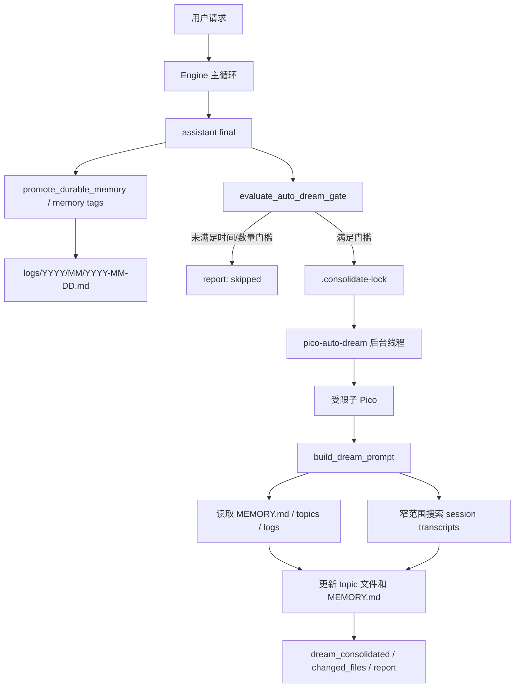

# Dream 后台记忆整合设计

这篇主要回答一个问题：

**`Pico` 的 Dream 功能到底在系统里解决什么问题，它现在怎么实现，和 Claude Code/Managed Agents 的 Dream 设计相比还差什么。**

先给结论。

`Pico` 现在的 Dream 不是主循环里的思考步骤，也不是一个定时跑脚本的外壳。它更准确的定位是：**在用户请求结束之后，用一个受限的子 `Pico` 对 durable memory 做后台维护，把零散日志、旧 topic 文件和历史 session 里的稳定信号整理成下一次会话能读懂的长期记忆。**

这件事的难点不在于让模型多总结几句话。

真正的难点有四个：

1. 长期记忆不能无限塞进 prompt。
2. 记忆写入不能让模型获得无限文件写权限。
3. 整理记忆不能阻塞用户当前任务。
4. 旧记忆、重复记忆、矛盾记忆必须能被修正，而不是越积越乱。

`Pico` 当前实现已经把这四个问题拆开了：用 `.pico/memory` 做文件型记忆目录，用 `MEMORY.md` 做入口索引，用 `logs/` 做 append-only 输入流，用 `topics/` 承接整理后的主题记忆，用 `.consolidate-lock` 控制自动整理节奏，再用一个 `dream` tool profile 和 `write_scope` 把 Dream 子运行时限制在记忆目录内。

这套实现已经很接近 Claude Code `autoDream` 的核心形态：后台 fork 一个受限 agent，让它读 memory 和 transcripts，再更新 memory。差异也很明确：Claude Code 和 Anthropic Managed Agents 更强调异步任务生命周期、输出 memory store、取消/归档、UI 可观测性和更强的失败处理；`Pico` 当前更轻，直接在本地 memory 目录原地整理。

---

## 为什么需要 Dream，而不是只靠 `/remember`

如果只看功能表，`/remember` 已经能保存长期记忆，`<memory>...</memory>` 也能把 final answer 里的内容写进 daily log。那为什么还需要 Dream？

因为保存和整理是两件不同的事。

`/remember` 解决的是入口问题：当前这一刻有什么东西值得记下来。它适合记录用户明确要求保存的偏好、项目约定、外部资料位置，或者一次任务结束后值得沉淀的结论。

Dream 解决的是维护问题：这些记录过一段时间之后，怎么去重、合并、修正、分类，并把真正有用的内容放到未来 session 能快速找到的位置。

长期记忆如果没有后台整理，最后会变成三种坏状态。

第一种是索引膨胀。`MEMORY.md` 越写越长，最后每次 session 启动都要带一大段内容。Claude Code 官方 memory 文档里也明确把 entrypoint 控制在前 200 行或 25KB 以内，详细内容放到 topic 文件里按需读取。`Pico` 沿用了这个方向，`MEMORY.md` 是索引，不是知识正文。

第二种是重复和矛盾。用户今天说用 `uv`，后来改成 `pipx`，如果只追加不整理，未来模型同时看到两个版本，很容易选错。Dream 的价值是回到源文件修正旧事实，而不是再补一条新事实。

第三种是瞬时状态污染长期记忆。当前目标、下一步、调试输出、失败栈、临时命令都很像有用信息，但它们通常不该活到下一周。当前代码里 `reject_durable_reason()` 已经显式过滤 secret-shaped 文本、checkpoint-like 前缀、长日志和 stdout/stderr/traceback 这类噪声；Dream prompt 也要求不要保存 transient task state。

所以 Dream 的核心职责可以概括成一句话：

**把短期输入流里的稳定信号，整理成低噪声、可索引、可修正的长期记忆。**

---

## 当前系统里 Dream 站在哪一层

`Pico` 的记忆系统现在可以分成三层。

第一层是会话内工作记忆。

这层由 `LayeredMemory` 维护，主要服务当前 session：任务摘要、最近文件、文件短摘要、少量 episodic notes。它解决的是下一轮模型调用不要重复读文件、不要忘掉刚发生的操作。

第二层是 durable memory 输入流。

这层落在 `.pico/memory/logs/YYYY/MM/YYYY-MM-DD.md`。`/remember`、final answer 里的 `<memory>` 标签、以及部分显式 durable promotion 都会把候选信息追加到这里。它是原始记录，不要求每一条都立刻变成高质量知识。

第三层是 durable memory 整理结果。

这层由 `.pico/memory/MEMORY.md` 和 topic 文件组成。`MEMORY.md` 只保存短索引，topic 文件保存有 frontmatter 的结构化记忆。ContextManager 会把 memory system section 和当前 `MEMORY.md` 注入 prompt，让模型知道已有长期记忆在哪里，以及什么时候该读取。

Dream 就站在第二层和第三层之间。

它不是替代 `LayeredMemory`，也不是替代 `/remember`。它是一个维护工序：读取 logs、已有 topic 文件和必要的 session transcript，把候选信号整理成长期记忆。



这张图里最重要的是运行时隔离。

主 `Pico` 负责完成用户任务。Dream 子 `Pico` 负责整理 memory。两者复用 model client 和 session store，但子 `Pico` 的 feature flags 会关闭 `memory` 和 `relevant_memory`，tool profile 切到 `dream`，写入范围限制在 memory 目录。

这个设计避免了一个常见问题：如果让主循环一边执行用户任务一边整理长期记忆，prompt 会变复杂，权限边界会变模糊，失败也难判断到底是用户任务失败还是记忆维护失败。

---

## 数据模型：文件型 memory store

`Pico` 当前选择的是文件型 durable memory，而不是数据库、向量库或一张 JSON 大表。

默认目录是：

```text
.pico/memory/
├── MEMORY.md
├── logs/
│   └── YYYY/MM/YYYY-MM-DD.md
├── topics/
│   ├── project-conventions.md
│   ├── key-decisions.md
│   ├── dependency-facts.md
│   └── user-preferences.md
└── .consolidate-lock
```

`ensure_memory_dir()` 会创建 `logs/`、`topics/` 和 `MEMORY.md`。如果索引不存在，默认写入一段空索引说明：`/remember` 写 daily log，`/dream` 把 logs 整理进 topic 文件。

这个目录拆法有几个工程上的好处。

### `MEMORY.md` 是启动索引

`MEMORY.md` 的职责是让模型快速知道有哪些记忆文件、每个文件大概解决什么问题。

它不应该保存大量正文。当前 prompt 里明确要求它少于 200 行，每一条控制在短描述级别。Claude Code 官方 memory 文档也采用类似口径：entrypoint 在 session 启动时加载前 200 行或 25KB，详细 topic 文件按需读取。

这个设计的价值是控制每轮 prompt 的固定成本。

如果把所有长期记忆都塞进入口文件，记忆越有用，prompt 越重，最后会反过来降低 agent 稳定性。把入口文件做成索引，可以让长期记忆规模增长，但启动 prompt 仍然保持可控。

### `logs/` 是 append-only 输入流

`logs/YYYY/MM/YYYY-MM-DD.md` 保存的是候选信号。

`append_to_daily_log()` 只做很简单的事：把文本 strip 掉空白，加上 `HH:MM` 时间戳，追加到当天日志文件。

这个实现故意简单。入口阶段不急着做复杂归类，因为用户刚说完某件事时，模型未必知道它未来属于哪个 topic，也未必知道它会不会被后续事实推翻。

先保存为日志，后面由 Dream 做整理，这比入口处直接写入 topic 更稳。

### `topics/` 是整理后的长期记忆

当前代码里内置了四个默认 durable topic：

- `project-conventions`
- `key-decisions`
- `dependency-facts`
- `user-preferences`

同时 memory system section 里要求结构化记忆文件使用 frontmatter：`name`、`description`、`type`，其中 `type` 只能是 `user`、`feedback`、`project`、`reference`。

这里有一个值得注意的设计缝隙：默认 topic 名和 frontmatter type 是两套分类。

这不是运行错误，但从设计上看还可以再收敛。topic 更像文件组织方式，type 更像语义类型。后续最好明确两者关系，例如：

- `topics/user-preferences.md` 主要承载 `type: user` 或 `type: feedback`
- `topics/key-decisions.md` 主要承载 `type: project`
- `topics/dependency-facts.md` 主要承载 `type: reference` 或 `type: project`

否则 Dream 子 agent 在新增文件时，可能会在 topic 和 type 之间摇摆，产生近似重复文件。

### `.consolidate-lock` 同时承担锁和时间戳

`.consolidate-lock` 有两个作用。

第一，它是并发锁。自动 Dream 满足条件后会先 `try_acquire_lock()`，避免多个后台整理任务同时改 memory。

第二，它的 mtime 是上次整理时间。`read_last_consolidated_at()` 直接读取这个文件的修改时间，`evaluate_auto_dream_gate()` 用它计算距离上次 consolidation 过去多久。

这个设计很 Unix：一个本地文件承载状态，不需要额外服务。

代价也很清楚：如果 lock 文件被外部手动改动，时间门槛判断会被影响；如果进程异常退出，需要 stale holder 逻辑兜底。当前实现里 `HOLDER_STALE_S = 3600`，一小时内如果 holder pid 还活着就认为锁还被占用，超过或 pid 不存在则允许接管。

---

## 写入路径：哪些内容会进入 durable memory

Dream 只负责整理，不应该承担所有写入入口。当前系统有三条进入 durable memory 的路径。

### `/remember <text>`

CLI 里 `/remember` 会调用 `agent.remember_durable_note(note)`，后者调用 `append_to_daily_log()`，并向 session event bus 发送 `memory_note_appended`。

这条路径最直接，适合用户显式说记住某件事。

它的优势是意图明确，不需要模型从一大段回答里猜是不是要保存。它的限制是保存粒度取决于用户输入，通常还需要 Dream 后面整理。

### final answer 里的 `<memory>` 标签

`maintain_memory_after_turn()` 会从 final answer 中提取 `<memory>...</memory>` 标签，并追加到 daily log。这个机制适合模型在完成任务后主动沉淀少量稳定结论。

这条路径的风险是模型可能过度保存。为了解决这个风险，memory system section 里列了明确的 not-to-save 规则：不要保存可从代码/git 推导出的架构和 API，不要保存 recent changes，不要保存 secrets、raw command output、stack traces、临时 blockers 和 next steps。

这里的原则是：长期记忆只保存未来 session 读代码也不容易知道的信息。

### `promote_durable_memory()`

主循环在 final 成功后会调用 `agent.promote_durable_memory(user_message, final)`。

这条路径依赖用户请求里出现持久化意图，例如英文的 `remember/save/store/persist`，或者中文的 `记住/保存/记录/长期记忆/持久记忆`。然后它从 final answer 里识别固定前缀行：

- `Project convention: ...`
- `Decision: ...`
- `Dependency: ...`
- `Preference: ...`
- `项目约定：...`
- `决策：...`
- `依赖：...`
- `偏好：...`

识别到之后再做 rejection 检查，过滤 secret-shaped 文本、checkpoint-like 临时状态、stdout/stderr/traceback 和过长噪声。

这条路径的设计意图是让 assistant 可以用固定格式把少量稳定事实提升为 durable memory，而不是每次都靠自由文本解析。

---

## 自动 Dream 什么时候触发

自动 Dream 不应该每轮都跑。

每轮都跑会带来三个问题：成本高、记忆还没形成足够增量、后台任务容易和用户下一轮交互抢资源。

当前 `Pico` 用三个门槛控制自动触发。

### 时间门槛

`dream_interval_hours` 默认是 24 小时。CLI 参数是 `--dream-interval`。

如果距离上次 consolidation 不足这个时间，`evaluate_auto_dream_gate()` 返回 `interval_gate`。

这个门槛解决的是过度整理问题。记忆整理不是实时 UI 更新，它更像一次低频维护任务。每天一次是合理默认值。

### session 数量门槛

`dream_min_sessions` 默认是 5。CLI 参数是 `--dream-min-sessions`。

`list_sessions_since()` 会扫描 session store 下 mtime 晚于上次 consolidation 的 `.json` 或 `.jsonl` 文件，排除当前 session，再统计数量。如果不足阈值，返回 `session_gate`。

这个门槛解决的是空跑问题。只有时间过去了但没有足够新 session，Dream 也不值得启动。

### 并发门槛

前两个门槛满足后，`maintain_memory_after_turn()` 会尝试拿 `.consolidate-lock`。

如果拿不到，返回 `lock_held`。如果拿到锁，就把状态标记为 `submitted`，发出 `auto_dream_started` 事件，启动名为 `pico-auto-dream` 的 daemon thread。

这里没有阻塞主回答。用户已经拿到了 final answer，后台整理继续跑。

### 单次 session cap

`DREAM_SESSION_CAP = 30`。如果待整理 session 超过 30 个，`build_dream_prompt()` 只列最近 30 个，并在 prompt 里说明这次只处理最近一批，下一次 Dream 再继续。

这个 cap 是一个实际运行经验驱动的保护。

session id 列表本身就会占上下文，transcript 检索也可能诱导模型读取过多历史。过去出现过 Dream prompt 因为 75+ session id 撑爆上下文导致 provider 返回 empty response 的风险，所以当前实现选择小批量处理。

这也说明 Dream 不是越贪越好。长期记忆维护更适合增量、小批、可恢复。

---

## Dream 子运行时怎么被限制住

`run_dream()` 是当前功能最关键的函数。

它没有直接写一套单独的 summarizer，而是创建一个新的 `Pico` 实例：

- `model_client` 复用父 agent。
- `workspace` 仍然是当前 repo。
- `session_store` 复用父 agent。
- `approval_policy="auto"`。
- `max_steps` 至少 20。
- `max_new_tokens` 至少 4096。
- `feature_flags` 关闭 `memory` 和 `relevant_memory`。
- `write_scope` 只指向 memory 目录。
- `auto_dream=False`，避免 Dream 里再触发 Dream。
- `set_tool_profile("dream")`。

这个选择的好处是复用现有 runtime、tool executor、permission checker、trace 和 model client。Dream 不需要另一套执行系统。

但它也要求权限层必须足够硬。

### tool profile 只给读和 memory 写

`build_tool_profiles()` 里 `dream_tools = read_only | {"write_file", "patch_file"}`。

这意味着 Dream 子 agent 可以读取已有记忆和 transcript，可以写或 patch memory 文件，但不能调用 coordinator 工具、mode 工具、interactive 工具，也不能跑 worker/subagent 编排。

它不是一个完整 agent，只是一个受限维护 agent。

### write_scope 把写入限制到 memory 目录

`PermissionChecker._check_write_scope()` 会把工具请求里的 path resolve 到 runtime path，再检查它是否落在 `runtime.write_scope` 的某个 scope 之下。

Dream 子 agent 的 `write_scope` 是 memory 目录相对 repo root 的路径。也就是说，即使 `approval_policy="auto"`，`write_file` 和 `patch_file` 也只能写 `.pico/memory` 下的文件。

这是 Dream 设计里最重要的安全边界。

如果没有这个边界，后台记忆整理任务就拥有了自动改仓库代码的能力。那样一旦 prompt 误导或模型误判，Dream 可能在用户没请求的时候改业务文件。当前实现没有这个问题。

### Dream 自己不加载 memory

子 agent 的 `feature_flags` 关闭了 `memory` 和 `relevant_memory`。

这点容易被忽略，但很重要。

Dream 的任务就是整理 memory。如果它在自己的 prompt 里又自动加载当前 memory system section、relevant memories 和工作记忆，很容易造成循环污染：它一边整理 memory，一边被旧 memory 强烈影响。当前做法让 Dream prompt 成为主要指令来源，再让它显式读取 memory 目录。

这个设计更接近一次可控的维护任务，而不是普通用户对话。

---

## Dream prompt 为什么分四个阶段

`build_dream_prompt()` 生成的 prompt 分成四个阶段：

1. Orient
2. Gather recent signal
3. Consolidate
4. Prune and index

这个结构基本对应一次人工整理记忆时的顺序。

### Phase 1: Orient

先列 memory 目录，读 `MEMORY.md`，再 skim 已有 topic 文件。

这一步解决重复文件问题。

如果不先看已有结构，模型很容易看到一条新日志就创建一个新文件，最后 topic 变成几十个近似文件。Orient 阶段要求它先理解现状，再决定是更新旧文件还是新增文件。

### Phase 2: Gather recent signal

Prompt 把来源优先级排得很清楚：

1. daily logs
2. 已有 memories 里的漂移事实
3. 必要时对 transcript 做窄范围 grep

这里的关键是窄范围搜索。

Dream 有 transcript dir，但 prompt 明确说不要 exhaustive read，不要读整个 JSONL，只在已经怀疑某个信息重要时用窄词搜索。

这和 ReAct 论文里的 reasoning + acting 思路是一致的：模型不是只在脑内总结，也不是盲目读全量环境，而是带着当前判断去调用外部工具拿证据。区别在于 ReAct 主要讨论任务求解过程，Dream 用在任务结束后的记忆维护。

### Phase 3: Consolidate

这一步要求把值得记住的信息写入或更新 memory 文件，同时遵守 Auto Memory section 的文件格式、type 约定和 not-to-save 规则。

这里最重要的动词是更新。

长期记忆维护不能只追加。它必须能删除 contradicted facts，能把 relative dates 转成 absolute dates，能把重复条目合并到同一个 topic 文件里。

这也是 Dream 相比 `/remember` 的核心价值。

### Phase 4: Prune and index

最后更新 `MEMORY.md`，保持它短、小、像索引。

Prompt 要求每个 entry 形如：

```markdown
- [Title](file.md) - one-line hook
```

并要求移除 stale/wrong/superseded 指针，把 verbose index entries 下沉到 topic 文件。

这一步让长期记忆不会因为有用而失控增长。

---

## 和 Claude Code 当前设计的对应关系

这里的 Claude Code 参考来自两类材料：

1. 官方 Claude Code memory 文档。
2. 本地 `civil-engineering-cloud-claude-code-source-v2.1.88/02-claude-code-source-research` 里的源码研究材料。后者应当按社区恢复/研究材料理解，不要在面试里说成官方完整内部源码。

从设计形态看，`Pico` 当前 Dream 和 Claude Code 的 `autoDream` 有几处明显对齐。

### 对齐点一：Memory directory + entrypoint

Claude Code auto memory 使用项目级 memory directory，里面有 `MEMORY.md` entrypoint 和多个 topic 文件。`MEMORY.md` 是启动索引，有行数和字节上限。

`Pico` 也采用 `.pico/memory/MEMORY.md + topics/ + logs/`。

这说明 `Pico` 没有把 memory 做成一段不断扩写的大 prompt，而是把 memory 当成一个可维护的本地文件系统。

### 对齐点二：自动整理是后台 fork/fork-like agent

Claude Code 源码研究材料里，`autoDream` 会在满足 gate 后创建后台任务，用受限工具集读取 memory 和 transcripts，再更新 memory。

`Pico` 也是在主 turn 结束后启动 `pico-auto-dream` daemon thread，里面创建子 `Pico` 运行 `build_dream_prompt()`。

这背后的工程判断一致：用户任务和记忆维护要分开，整理失败不应该把用户任务变成失败。

### 对齐点三：工具权限收窄

Claude Code 的 `createAutoMemCanUseTool()` 允许读类工具，允许 memory 目录内的 Edit/Write，拒绝其他写入。

`Pico` 的等价实现是 `dream` tool profile 加 `write_scope`。

这比只在 prompt 里写一句不要改别的文件要可靠。权限边界由 runtime enforce，不由模型自觉保证。

### 对齐点四：时间、session、lock gate

Claude Code autoDream 默认也是约 24 小时、5 sessions，并使用 consolidation lock 记录 lastConsolidatedAt。

`Pico` 采用 `dream_interval_hours=24.0`、`dream_min_sessions=5`、`.consolidate-lock` mtime。

这个选择说明 Dream 被当成低频维护任务，而不是每轮 summary。

---

## 和 Claude Code 相比，Pico 现在少了什么

当前实现已经有骨架，但还不是完整的 Dream 产品化形态。

### 1. 手动 `/dream` 没有走同一把锁

自动 Dream 会先 `try_acquire_lock()`，失败则跳过。

CLI 里的 `/dream` 直接调用 `agent.run_dream()`。`run_dream()` 内部会在结束后 `record_consolidation()`，但启动前没有拿 lock。

这意味着手动 `/dream` 和后台 auto dream 理论上可能并发写 memory。概率不高，但这是一个真实边界。

更稳的做法是把 lock acquisition 下沉到 `run_dream()` 或新增一个 `run_dream_with_lock()`，让手动和自动共享同一套并发控制。手动命令可以带 `force` 语义，但也应该显式处理并发。

### 2. 没有 Dream task 生命周期对象

Claude Code 研究材料里有 `DreamTask`，负责 UI 状态、complete/fail/kill、rollback 等任务生命周期。

`Pico` 当前只有后台 thread、session event bus、trace 和 `last_memory_maintenance`。这对 CLI harness 已经够用，但如果要做 TUI 或更强的可观测性，还缺一个任务对象：

- dream id
- pending/running/completed/failed/canceled
- started_at/ended_at
- session_ids
- changed_files
- error
- cancel/kill

没有这个对象时，用户只能从 report 或 event 里看到结果，不能像管理一个后台任务那样管理 Dream。

### 3. 没有输出 memory store

Anthropic Managed Agents Dreams 的官方设计是：输入一个 existing memory store 和最多 100 个 sessions，Dream 异步生成一个新的 output memory store。输入 store 不被修改，用户可以审查输出后选择使用或丢弃。

`Pico` 当前是在 `.pico/memory` 原地修改。

原地修改适合本地 CLI：简单、直接、没有额外存储生命周期。缺点是回滚能力弱。虽然 git 可以帮 `.pico` 文件回滚，但 `.pico` 通常未必进版本控制。

如果后续想提升可靠性，可以引入两阶段写入：

1. Dream 写到 `.pico/memory/.dream-runs/<run_id>/output/`
2. 生成 diff/report
3. 用户或策略确认后 apply 到 `.pico/memory`

这会更接近 Managed Agents 的 output store 思路，但实现复杂度也明显增加。

### 4. 没有 scan throttle 和失败退避

当前 `evaluate_auto_dream_gate()` 每次 turn 后都会扫描 session store。一般情况下问题不大，但大型 session 目录里可以考虑 scan throttle。

Claude Code 研究材料里有更细的 gate 顺序和 scan 控制，避免频繁扫描和频繁失败。

`Pico` 后续可以补两件事：

- 记录最近一次 session scan 时间，短时间内直接复用结果。
- 对连续失败的 Dream 做退避，避免每次满足 gate 都重复触发同一个 provider 错误。

### 5. 没有独立 session memory 层

Claude Code 除了 durable memory，还有 session memory、compact、extract memories 等不同维护层。

`Pico` 当前有 `LayeredMemory`、context compaction 和 durable memory，但 Dream 直接面向 durable memory，暂时没有独立的 session memory markdown。

这不一定是缺陷。

对当前 Pico 目标来说，先把 durable memory 做稳更重要。等长会话复杂度继续上升时，再考虑增加 session memory 层，把单个 session 内的长期上下文和跨 session durable memory 分开。

---

## 和 Managed Agents Dreams 的关系

Anthropic Managed Agents 官方 Dreams 文档给出的定义很明确：Dream 让 Claude 回顾过去 sessions，整理 agent memory，清理重复、矛盾和过期条目，并输出一个新的 memory store。

这对 `Pico` 有两个直接启发。

第一，Dream 应该被看作 memory store maintenance，而不是普通总结。

普通总结关注压缩信息。Dream 关注的是维护一个未来会被继续使用的 store。它需要去重、修正、重组、输出可复用结构。

第二，Dream 应该有异步任务生命周期。

官方 Dreams 是 pending/running/completed/failed/canceled 的异步资源，可以 poll，可以看 usage，可以取消，可以归档。`Pico` 当前已经有后台线程和事件，但还没有把 Dream 暴露成一等资源。

不过 `Pico` 不应该照搬 Managed Agents API。

Managed Agents 是云端 API，Memory Store 是平台资源；`Pico` 是本地 coding harness，memory 是本地文件。照搬 output store、archive、billing、resource id 会让实现变重。

更合适的迁移方向是吸收它的三个工程原则：

1. 输入和输出最好可区分，方便审查和回滚。
2. Dream 是异步任务，应该有状态和错误。
3. 成本随 sessions 数量和长度增长，应该小批量、可观察地跑。

---

## 论文里的 memory 思路怎么映射到 Pico

这部分不用把论文背成百科，只抓和 `Pico` Dream 相关的设计判断。

### ReAct：行动和判断要交替

ReAct 的核心贡献是让 LLM 在任务中交替生成 reasoning traces 和 actions，通过外部环境获取信息，再更新计划和判断。

`Pico` 主循环本身是 ReAct 风格：模型思考下一步，调用工具，读结果，再决定继续或结束。

Dream 继承的是这个方法的后半部分：它不是让模型坐在 prompt 里凭记忆总结，而是给它读文件、搜索 transcript、patch memory 的工具，让它基于证据维护记忆。

这里的边界也要讲清楚：Dream 不是任务求解 agent。它的 actions 被限制在 memory 维护上，不能扩大成 general worker。

### Generative Agents：记忆需要 reflection

Generative Agents 论文里有一个对 agent memory 很重要的结构：完整经验记录、基于时间的反思、动态检索，再用这些记忆去规划行为。

`Pico` 当前没有做完整的 social simulation，也没有做复杂 planning。它借鉴的是更窄的一点：经验记录不能直接等于长期记忆，中间需要 reflection。

在 `Pico` 里：

- daily logs 类似经验输入流。
- Dream 是 reflection pass。
- `MEMORY.md` 和 topic files 是整理后的长期记忆。
- ContextManager 在未来 session 把入口索引带回 prompt。

也就是说，`Pico` 实现的是代码 agent 场景下的一小块反思机制，不是完整的生成式角色架构。

### MemGPT：上下文窗口外要有层级记忆

MemGPT 从操作系统的层级内存得到启发，把有限 context window 外的长上下文管理成不同 memory tiers。

`Pico` 的实现更简单，没有虚拟内存式 paging，也没有 interrupt-based control flow。但它解决的是同一类压力：context window 有限，不能把所有历史都放进去。

`Pico` 的做法是显式文件层级：

- 启动只加载 `MEMORY.md` 短索引。
- 详细 topic 文件按需读取。
- transcript 只做窄范围搜索。
- Dream 定期把日志压成 topic，而不是让日志无限进入 prompt。

这个方案不如 MemGPT 通用，但对本地 coding harness 更容易解释、调试和审查。

---

## 当前实现的关键取舍

### 取舍一：文件系统优先，不先上数据库

文件系统的好处是透明。

用户可以直接打开 `.pico/memory`，看到模型记住了什么，删掉错误内容，检查 Dream 改了哪些文件。对一个本地 agent harness 来说，这比一开始就上数据库或向量库更合适。

代价是查询能力弱。未来如果 topic 文件很多，靠 `rg` 和模型读索引可能不够，需要更好的 metadata 或 embedding。

当前阶段不急着上向量库。先把索引、topic、Dream 维护做稳，比引入复杂检索层更重要。

### 取舍二：Dream 复用 Pico runtime，不写独立 worker

复用 Pico runtime 让实现很小：

- 复用 model client。
- 复用 tool executor。
- 复用 permission checker。
- 复用 trace/session event。
- 复用 workspace path 解析。

代价是 Dream 子 agent 仍然带着一个完整 runtime 的复杂度。它需要通过 feature flags 和 tool profile 被主动收窄，否则就会变成另一个普通 Pico。

当前实现已经做了关键收窄：关闭 memory/relevant_memory，设置 `dream` profile，设置 `write_scope`，关闭 auto dream。

### 取舍三：后台线程而不是外部 scheduler

后台线程很轻，适合 CLI。用户拿到 final 后，Dream 继续整理，不需要单独守护进程。

代价是生命周期跟当前进程绑定。如果 CLI 进程结束太快，daemon thread 可能还没跑完。当前实现更适合交互式 session，而不是严格保证每次都会完成的离线作业。

如果未来要保证 Dream 一定完成，就需要外部 job runner 或非 daemon thread 的显式等待策略。现在先保持轻量是合理的。

### 取舍四：原地修改 memory，而不是产出候选 store

原地修改最简单，也符合本地文件直觉。

但从可靠性看，两阶段输出更好。Managed Agents Dreams 选择输出新 store，就是为了让输入 store 不被直接破坏，用户可以审查后切换。

`Pico` 如果继续面向面试和本地 harness，原地修改可以接受。要往更成熟的产品形态走，就应该考虑 `.dream-runs/<id>/output` 或 patch review 流程。

### 取舍五：小批量 session cap

`DREAM_SESSION_CAP = 30` 不是随意数字。它反映了一个现实问题：Dream 的输入规模不可控时，很容易触发 provider 上下文或输出异常。

长期记忆整理追求的是稳定增量，而不是一次吞完全部历史。

这和官方 Dreams 文档里的成本提示一致：成本会随输入 sessions 数量和长度大致增长，应该从小批量开始。

---

## 失败模式和当前防线

### 1. Dream 写出重复 memory

原因通常是没有先读已有 topic 文件，或者 `MEMORY.md` 索引不清楚。

当前防线：

- prompt 的 Orient 阶段要求先读 index 和 topic。
- Consolidate 阶段要求优先 merge，而不是创建近重复文件。
- Prune 阶段要求删除 stale/superseded 指针。

还可以补：

- memory lint：检查多个 topic 文件的 `name`/`description` 是否高度相似。
- Dream report：列出本次为什么新增文件而不是更新旧文件。

### 2. Dream 保存瞬时任务状态

原因是模型把当前 turn 的 next step、blocker、command output 当成未来也有用的信息。

当前防线：

- `reject_durable_reason()` 过滤 checkpoint-like 前缀。
- memory system section 明确列出不要保存 transient task details、current blockers、next steps。
- Dream prompt 明确要求不要保存 raw command output、stack traces、transient task state。

还可以补：

- 对 Dream 写入的 topic 文件做后置检查，出现 `下一步`、`当前目标`、`stdout`、`traceback` 等词时给 warning。

### 3. Dream 保存秘密

当前防线：

- `SECRET_SHAPED_TEXT_PATTERN` 会过滤 `api key/token/secret/password` 和类似 `sk-...` 的值。
- prompt 明确禁止保存 secrets、credentials、tokens、private keys。

边界：

- 正则只能挡住明显 secret-shaped 文本。更隐蔽的凭据格式仍可能漏过。

可以补：

- 接入项目已有 secret redaction 逻辑，对 Dream output 做同样扫描。
- 对 `.pico/memory` 写入做统一 pre-write guard，而不只是在 promotion 阶段过滤。

### 4. Dream 和手动编辑冲突

用户可能正在手动改 `.pico/memory`，后台 Dream 同时 patch 文件。

当前防线较弱。

可以补：

- Dream 开始前保存 memory snapshot。
- 写入前检查文件 hash 是否仍等于开始时读取的版本。
- 如果不一致，写入候选 patch 而不是直接覆盖。

### 5. Provider 返回空响应或超时

原因可能是 prompt 太长、session 太多、输出预算不够、模型后端不稳定。

当前防线：

- `DREAM_SESSION_CAP = 30`。
- `DREAM_MIN_NEW_TOKENS = 4096`。
- 自动 Dream 失败时会把 lock mtime 恢复到 previous mtime，并记录 `memory_auto_dream_failed`。

还可以补：

- 连续失败计数和退避。
- 失败后缩小 session batch，例如 30 -> 10。
- 在 report 里记录 input session 数和 prompt metadata，方便定位是不是上下文过大。

### 6. `.consolidate-lock` 状态不准

当前 lock 文件既是锁又是 last consolidated timestamp。实现简单，但状态混用。

可以补：

- 保留 `.consolidate-lock` 做锁。
- 新增 `.last-consolidated.json` 保存 last_success_at、session_ids、changed_files、error。

这样 gate 逻辑和并发锁会更清晰，调试也更方便。

---

## 这个功能面试里怎么讲

面试里不要把 Dream 讲成模型自动总结。

更好的讲法是：

`Pico 的长期记忆不是每轮都把历史塞回 prompt，而是分成输入流和整理结果。/remember 和 <memory> 先把候选信息写进 daily log，Dream 在 turn 结束后按时间和 session 数触发，启动一个受限子 agent 去读 memory、logs 和必要的 transcripts，把稳定信号合并进 topic 文件，再维护 MEMORY.md 索引。这样既能跨 session 保存用户偏好和项目决策，又不会让 prompt 无限增长，也不会给后台任务开放任意写仓库的权限。`

追问为什么不用普通 summary，可以这样说：

`summary 主要是压缩一段上下文，Dream 维护的是一个会被未来 session 反复使用的 memory store。它要解决重复、矛盾、过期和索引膨胀，所以它需要读已有 memory、修改旧文件、删除 stale entry，而不是只产出一段摘要。`

追问为什么要单独子 agent，可以这样说：

`主 agent 的职责是完成用户任务，Dream 的职责是维护 memory。拆成子 agent 后可以独立限制工具集和写入范围，失败也只影响 memory maintenance，不影响这轮用户任务。Pico 里 dream profile 只允许读工具和 write/patch，write_scope 限制在 .pico/memory，这比靠 prompt 约束安全。`

追问和 Claude Code/Managed Agents 的区别，可以这样说：

`我参考的是它们的工程形态，不是照抄 API。Claude Code autoDream 也是后台受限 agent 加 memory 目录和 gate；Managed Agents Dreams 更像云端异步资源，会输出新的 memory store，输入 store 不直接修改。Pico 现在是本地 CLI harness，所以选择原地修改 .pico/memory，换来简单透明。后续如果要更产品化，可以补 DreamTask 生命周期和 output candidate store。`

---

## 后续改进路线

这部分按优先级排。

### P0：统一手动和自动 Dream 的锁

把 lock 逻辑下沉到 Dream 执行入口，保证 `/dream` 和 auto dream 不会并发写 memory。

验收标准：

- 自动 Dream 持锁时，手动 `/dream` 返回明确提示。
- 手动 `/dream` 跑完后同样更新 last consolidated timestamp。
- 测试覆盖 stale lock、lock held、manual run 三种情况。

### P1：增加 memory lint

Dream 写完后跑一个确定性检查：

- `MEMORY.md` 不超过 200 行。
- `MEMORY.md` entry 指向的文件存在。
- topic 文件 frontmatter 包含 `name/description/type`。
- `type` 在允许集合内。
- 文件中没有明显 secret-shaped 文本。
- 文件中没有常见 transient task state 前缀。

验收标准：

- lint warning 进入 run report。
- 严重问题可以让 Dream 标记 failed 或 partial。

### P1：Dream report 结构化

当前 `last_dream_changed_files` 能告诉改了哪些文件，但不能解释为什么改。

建议让 Dream 输出结构化 summary：

```json
{
  "updated": ["topics/user-preferences.md"],
  "created": [],
  "pruned": ["topics/old-debugging.md"],
  "sources": ["logs/2026/05/2026-05-13.md", "session:..."],
  "skipped": [
    {"reason": "transient_task_state", "text_preview": "..."}
  ]
}
```

验收标准：

- report 能显示本次 Dream 做了什么。
- 失败时能看到处理到哪一步。

### P2：引入 DreamTask 生命周期

给 Dream 一个一等任务对象，至少包括：

- id
- status
- session_ids
- started_at/ended_at
- changed_files
- error
- cancel/kill 状态

这会让 TUI、CLI 和未来 webhook/automation 都更好接。

验收标准：

- `/dream` 能显示 running/completed/failed。
- auto dream 的后台状态能被查询。
- 失败不会只藏在 trace 里。

### P2：两阶段输出

把 Dream 的写入目标从原地 memory 目录改成 candidate output，再 apply。

轻量版本可以这样做：

```text
.pico/memory/.dream-runs/<run_id>/
├── input-snapshot.json
├── output/
├── report.json
└── patch.diff
```

验收标准：

- 输入 memory 不直接被破坏。
- 用户可以 review patch。
- apply 后再更新 `.consolidate-lock`。

这个改动收益大，但复杂度也高，不适合作为当前最先做的事。

### P3：更细的 session 选择策略

当前是按 mtime 找上次 consolidation 之后的 session，再截最近 30 个。

以后可以改成：

- 优先包含有 memory_note_appended、durable promotion、用户明确 correction 的 session。
- 跳过纯短问答或无工具调用 session。
- 失败后自动缩小 batch。

验收标准：

- 同样 token 预算下，Dream 命中更多真实可保存信号。
- 大 session 目录下不会每次扫描全量文件。

---

## 最小验收清单

当前 Dream 功能要算站得住，至少要覆盖这些测试和真实路径。

### 单元测试

1. `ensure_memory_dir()` 能创建 `MEMORY.md`、`logs/`、`topics/`。
2. `/remember` 能追加 daily log，并写 session event。
3. `<memory>` 标签能被 final 后处理提取。
4. `reject_durable_reason()` 能挡住 secret-shaped 文本、临时状态和长日志。
5. `evaluate_auto_dream_gate()` 对 interval gate、session gate、should_run 三种分支返回正确。
6. `build_dream_prompt()` 在 session_ids 超过 30 时截断，并在 prompt 里说明。
7. Dream 子 runtime 的 tool profile 不允许 run_shell、agent、ask_user。
8. write_scope 能挡住 memory 目录外写入。
9. auto Dream 失败时 lock mtime 能回滚。
10. auto Dream 成功后能记录 changed_files 和 `dream_consolidated` event。

### 真实 CLI 验收

最小真实链路可以这样跑：

下面命令假设项目 `.env`、`.pico.toml` 或全局配置里已经有可用 provider。`/remember` 和 `/memory` 主要验证本地写入与读取，`/dream` 会真正调用模型。

```bash
uv run pico "/remember Preference: Pico docs should be written in direct Chinese."
uv run pico "/memory"
uv run pico "/dream"
find .pico/memory -maxdepth 3 -type f | sort
```

如果用真实模型验收，重点看三件事：

1. `.pico/memory/logs/` 是否有原始 note。
2. Dream 是否创建或更新 topic 文件。
3. `MEMORY.md` 是否只保留短索引，而不是把完整记忆正文塞进去。

### 回归风险验收

改 Dream 时还要检查这些行为不能坏：

- 普通用户任务 final 不应该等待 auto Dream 完成。
- `--no-auto-dream` 必须完全跳过自动 Dream。
- `--dream-interval` 和 `--dream-min-sessions` 必须影响 gate。
- 子 Dream 不能触发另一个 auto Dream。
- Dream 失败不能把主任务标记为失败。

---

## 参考材料

本设计主要参考这些材料：

- 当前 `Pico` 代码：`pico/features/memory.py`、`pico/core/runtime.py`、`pico/core/tool_profiles.py`、`pico/core/permissions.py`、`pico/core/context_manager.py`、`pico/core/engine.py`、`pico/cli.py`。
- 本地 Claude Code 研究材料：`/Users/martinlos/code/civil-engineering-cloud-claude-code-source-v2.1.88/02-claude-code-source-research`。这份材料用于理解 `memdir`、`extractMemories`、`autoDream`、`DreamTask` 等设计形态，面试里应按社区恢复/研究材料表述。
- Anthropic Managed Agents Dreams 文档：`https://platform.claude.com/docs/en/managed-agents/dreams`。
- Claude Code memory 文档：`https://code.claude.com/docs/en/memory`。
- ReAct: Synergizing Reasoning and Acting in Language Models：`https://arxiv.org/abs/2210.03629`。
- Generative Agents: Interactive Simulacra of Human Behavior：`https://arxiv.org/abs/2304.03442`。
- MemGPT: Towards LLMs as Operating Systems：`https://arxiv.org/abs/2310.08560`。

---

## 最后把一句话收回来

`Pico` 的 Dream 功能可以这样定位：

**它是本地 coding agent 的后台记忆维护层，用受限子运行时把跨 session 的零散信号整理成可索引、可修正、低噪声的长期记忆。**

这个定位比模型自动总结更准确，也更能解释为什么代码里会有 memory directory、daily logs、topic files、entrypoint index、auto gate、lock、dream profile、write_scope 和后台线程。

当前实现已经把这条主线跑通。后面最值得补的不是更多 prompt，而是更硬的任务生命周期、更好的并发控制、结构化 report、memory lint，以及在需要时引入候选 output store。
